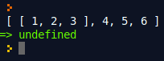
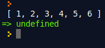

# ES6


### JS. версіонування
ES - це просто скорочення для ECMAScript. Кожне видання ECMAScript отримує абревіатуру ES з подальшим його номером. Всього існує 8 версій ECMAScript. ES1 була випущена в червні 1997 року, ES2 - в червні 1998 року, ES3 - в грудні 1999 року, а версія ES4 - так і не була прийнята. ES5 був випущений в грудні 2009 року, через 10 років після виходу третього видання.

Версія ES6 / ES2015 вийшла в червні 2015 року. Це також принесло якусь плутанину у зв'язку з назвою пакета, адже ES6 і ES2015 - це одне і те ж. З виходом цього пакету оновлень комітет прийняв рішення перейти до щорічних оновлень. Тому видання було перейменовано в ES2015, щоб показувати рік релізу.


## let. const


### var is sucks
В ES5 є два способи, щоб оголосити змінні:
1. Використовуючи ключове слово var
```js
var count = 1;
```
2. Без використання ключових слів у форматі ідентифікатор = значення(при умові, що [strict mode](https://developer.mozilla.org/ru/docs/Web/JavaScript/Reference/Strict_mode) не ввімкнений)
```js
count = 1;
```

Якщо другий спосіб — зло, так — як змінна оголошена таким способом має глобальну область видимості, навіть якщо знаходиться всередині функцій, то перший спосіб це єдине, що залишається для оголошення змінних.


### var is sucks
Але, ключове слово var також має свої недоліки. Давайте їх розглянемо.


### var is sucks
Область видимості, при оголошенні в циклах і умовних операторах.

```js
for(var i = 0; i<6; i++){
}
console.log(i); //6
if(true){
	var if_variable = 3;
}
console.log(if_variable); //3
```


### var is sucks
Перевизначення змінної.Якщо змінна вже була оголошена і ми хочемо ще раз оголосити змінну з таким же самим ідентифікатором, javascript дозволить це зробити.

```js
var counter = 1;
var counter = 2;
```

Хоча може здатися, що на цю особливість var можна було б і не звертати увагу, але сама ідея оголошення змінної, що вже існує, можливо є помилкою людини, майбутнім багом, який би хотілося дізнатися на місті, а не через процес дебага.


### var is sucks
Існування до моменту ініціалізації.Насправді змінна, оголошена через var вже існує, але її вміст невизначений. Розгляньмо наступний код:

```js
console.log(a); //undefined

var a = 3;
```

Значення змінної undefined, що означає, що її вміст не визначений.


### var is sucks
Класична задача "Армія функцій"
```js
function makeArmy() {

  var shooters = [];

  for (var i = 0; i < 10; i++) {
    var shooter = function() { // shooters function
      console.log( i ); // should output number of shooters
    };
    shooters.push(shooter);
  }

  return shooters;
}

var army = makeArmy();

army[0](); // shooter outputs 10, but need 0
army[5](); // shooter outputs 10...
// .. all shouters outputs
```


### let to the rescue
В ES6 передбачений новий спосіб для оголошення змінних через ключове слово var. **Зверніть увагу**, що ключове слово var також доступне і може бути використане.

Синтаксис оголошення змінних через ключове слово let:
```js
let ідентифікатор = значення;
let counter = 3;
```


### let to the rescue
Область видимості змінної let - блок {}

Якщо ми перепишемо минулий приклад, де була продемонстрована особливість оголошення змінної через var всередині циклів у умовних операторів із використанням ключового слова let, можна побачити, що let має цілком зрозумілу область видимості, а саме не видний за межами циклів і умовних операторів.

```js
for(var i = 0; i<6; i++){
}
console.log(i); //ReferenceError: i is not defined
if(true){
	var if_variable = 3; //3
}
console.log(if_variable); //ReferenceError: if_variable is not defined
```


### let to the rescue
Перевизначати змінну let не можна. Перевизначення призведе до помилки.

```js
let a = 1;
let a = 2; // Identifier 'a' has already been declared
```


### let to the rescue
Змінна let не існує до моменту ініціалізації, звернення до неоголошеної змінної призведе до помилки.

```js
console.log(a); //a is not defined

let a = 1;
```


### let to the rescue
Для кожної ітерації циклу використовується своя змінна.

```js
function makeArmy() {
  var shooters = [];
  for (let i = 0; i < 10; i++) {
    var shooter = function() { // shooters function
      console.log( i ); // should output number of shooters
    };
    shooters.push(shooter);
  }
  return shooters;
}

var army = makeArmy();
army[0](); // shooter outputs 10
army[5](); // shooter outputs 5...
// .. all shouters outputs
```


### const keyword
Оголошення const задає константу, тобто змінну, яку не можна змінювати:

```js
const LOCALE = 'UA';
LOCALE = "EU"; //TypeError: Assignment to constant variable.
```

В іншому оголошення const аналогічне let. **Зауважимо**, що якщо в константу присвоєно об'єкт, то від зміни захищена сама константа, але не властивості всередині неї:

```js
const user = {
  name: "Вася"
};
user.name = "Петя"; // Можна
user = 5; // Буде помилка
```


## Функції стрілки(Arrow functions)


### Функції стрілки(Arrow functions)
**Вирази стрілочних функцій** мають коротший синтаксис в порівнянні з функціональними виразами і лексично прив'язані до значення this (але не прив'язані до власного this, arguments, super, або new.target). Стрілочні функції завжди анонімні.


### Функції стрілки(Arrow functions)
Розгляньмо функцію вищого порядку, яка приймає іншу функцію і її викликає:

```js
function outer(innerFunc){
  var message = "Hello World";
  innerFunc(message);
}
outer(function(message){
  console.log(message);
});
```

Як параметр, при виклику функції outer ми передаємо анонімну функцію. Функція верхнього порядку(outer), приймає функцію і викликає її в собі.


### Функції стрілки(Arrow functions)
Розглянемо, як можна скоротити написання анонімної функції, при її передачі у функцію зовнішнього порядку.

```js
function outer(innerFunc){
  var message = "Hello World";
  innerFunc(message);
}
outer(message => {
  console.log(message);
});
```

Можна побачити, що ми позбавилися від написання ключового слова function і від дужок, які визначають параметри функції.


### Функції стрілки(Arrow functions)
Стрілочну функцію можна присвоїти змінній. Наприклад:

```js
var func1 = message => console.log(message);
let func2 = message => console.log(message);
const func3 = message => console.log(message);

func1('Func1'); //Func1
func2('Func2'); //Func2
func3('Func3'); //Func3
```

Зверніть увагу, що після оператора стрілка(=>) в прикладі відсутні фігурні дужки, їх можна опустити, якщо тіло стрілкової функції складається з одного виразу.


### Функції стрілки(Arrow functions)
За замовчуванням якщо в тілі стрілкової функції немає оператора return, він ставиться автоматично. Наприклад:

```js
const sum = (a, b) => a+b;
let res = sum(1,2);
console.log(res); //3
```


### Функції стрілки(Arrow functions)
Правила написання параметрів стрілкових функцій:


### Функції стрілки(Arrow functions)
кщо стрілкова функція не має жодного параметра, або має понад два, то параметри заточуються в круглі дужки:

```js
let func1 = () => 5;
let func2 = (a,b) => a+b;
let func3 = (a,b,c) => a+b+c;
```


### Функції стрілки(Arrow functions)
Якщо стрілкова функція має один параметр, то круглі дужки можна опустити:

```js
let func1 = a => a++;
let func2 = (a) => a++;
```


## Параметри за замовчуванням


### Параметри за замовчуванням
**Параметри за замовчуванням** дозволяють задавати формальним параметрам функції значення за замовчуванням, якщо для них не вказано значення або переданий undefined.


### Параметри за замовчуванням
ES5 немає такої фічі як параметри за замовчуванням. Щоб імітувати, використовувався патерн "параметри за замовчуванням". Працює він наступним чином:

```js
var sum = function(a, b) {
  a = (a !== undefined) ? a : 10;
  b = (b !== undefined) ? b : 20;
  return a + b;
};
```


### Параметри за замовчуванням
З релізом ES6 з'явилася можливість задавати параметри за замовчуванням при оголошенні функції:

Синтаксис:
```js
function [name]([param1[ = defaultValue1 ][, ..., paramN[ = defaultValueN ]]]) {
   statements
}
```

```js
var sum = function(a = 10, b = 20) {
  return a + b;
};
```


## Template Literals


### Template Literals
**Шаблонними літералами** називаються рядкові літерали, що дозволяють застосування виразів всередині. З ними ви можете використовувати багаторядкові літерали і строкову інтерполяцію. У специфікаціях до ES2015 вони називалися "шаблонними рядками".


### Template Literals
Синтаксис:

```js
let str1 = `some text`;
let str2 = `
some text
`;

console.log(str1); //some text
console.log(str2); //some text
```


### Template Literals
Для використання виразів всередині, використовується наступний синтаксис:

```js
`${expression}`
```

Наприклад:
```js
let counter = 1;
let terminator = 0;
let str = `
Terminator is ${terminator}. Counter variable is 
${counter}
`;
console.log(str); //Terminator is 0. Counter variable is 1
```


## Деструктуризація(Destructuring)


### Деструктуризація(Destructuring)
**Деструктуризація** просто розбиття складної структури на простіші частини. У JavaScript ця складна структура зазвичай є об'єктом або масивом. За допомогою синтаксису деструкції ви можете витягувати менші фрагменти з масивів і об'єктів.


### Object Destructuring
Рззглянемо наступний об'єкт:

```js
let car = {
  model: 'A8',
  brand: 'Audi',
  engine: 'V8'
};
```

Щоб деструктуризувати цей об'єкт потрібно в лівій частині присвоєння, перерахувати назви властивостей які ми хочемо мати, а в правій сам об'єкт деструктуризації:

```js
let car = {
  model: 'A8',
  brand: 'Audi',
  engine: 'V8'
};

const {model, brand} = car;
console.log(model, brand); //A8 Audi
```


### Object Destructuring
Досі ми призначали змінні, які мають таку ж назву, що і відповідний ключ об'єкта. За допомогою цього синтаксису можна призначити інше ім'я змінної: '''[object_key]: [variable_name]'''. Можна також передати значення за замовчуванням за допомогою синтаксису: ```[object_key]: [variable_name] = [default_value]```


### Object Destructuring
Використання відмінних ідентифікаторів від ключів, при деструктуризації об'єктів.

```js
const car = {
  model: 'A8',
  brand: 'Audi',
  engine: 'V8'
}

const {brand:title, price:price = 200000} = car;
console.log(`Product title is ${title} and price is ${price}`); //Product title is Audi and price is 200000
```


### Object Destructuring
Давайте дещо змінимо об'єкт car і додамо до нього вкладений об'єкт:

```js
const car = {
  model: 'A8',
  brand: 'Audi',
  engine: 'V8',
  audio: {
    power: '50DB'
  }
}
```


### Object Destructuring
Тоді деструктуризація вкладеного об'єкта буде виглядати як:
**Приклад №1:** Деструктуризація вкладеного об'єкта.

```js
const car = {
  model: 'A8',
  brand: 'Audi',
  engine: 'V8',
  audio: {
    power: '50DB'
  }
}
const {model, audio: {power}} = car;
console.log(`There is an audio system in ${model} with power ${power}`);
```


### Array Destructuring
Синтаксис деструктуризації масивів:

```js
var_keyword [var_name, var_name] = source;
```

де:

- var_keyword - var, let, const;
- var_name - ім'я зміінної(значення деструктуризації буде поміщено в цю зміну);
- source - масив для деструктуризації.


### Array Destructuring
Приклад:

```js
let modelsDb = ['latitude e6520', 'vostro r77', 'g9'];
let [m1, m2] = modelsDb;

console.log(m1); // latitude e6520
console.log(m2); // vostro r77
```

***Важливо:*** Якщо значень в масиві менше, ніж змінних — помилки не буде, просто присвоїти undefined. Якщо значень в масиві більше, вони будуть проігноровані.


### Array Destructuring
Непотрібні елементи масиву також можна видалити, поставивши додаткову кому:

```js
let [, , , cap] = "London is a capital of Great Britain".split(" ");

console.log(cap); // capital

let [lon, , , , , gre] = "London is a capital of Great Britain".split(" ");

console.log(lon); //London
console.log(gre); //Great
```


## Spread - оператор


### Spread - оператор
> Spread - оператор надає можливість розповсюджувати вирази в тих місцях, де попередньо передбачено використання декількох аргументів.

Spread - оператор має простий синтаксис:

'''js
...var_to_spread
'''

Де, var_to_spread - змінна, по якій можна ітеруватися.


### Додавання масивів
Уявіть, що ми хочемо в один масив додати інший і вирішуючи таку задачу написали наступний код:

```js
let arr1 = [1, 2 ,3];
let arr2 = [arr1, 4, 5 ,6];
console.log(arr2);
```




### Додавання масивів
Давайте, тепер використаємо spread - оператор додавши три точки(...) до змінної, яку ми хочемо розповсюдити:

```js
let arr1 = [1, 2 ,3];
let arr2 = [...arr1, 4, 5 ,6];
console.log(arr2);
```




### Використання, деяких матиматичних функцій
JavaScript має вбудований математичний об'єкт, який дозволяє нам робити деякі математичні обчислення. В цьому прикладі ми розглянемо на Math.max (). Функція Math.max () повертає найбільше число зі списку аргументів. Ось кілька прикладів:

```js
console.log(Math.max());// -Infinity
console.log(Math.max(1, 3));// 3
console.log(Math.max(100, 3, 4));// 100
```


### Використання, деяких матиматичних функцій
На жаль ви не можете використовувати масив як вхідний параметр, але ми можемо розповсюдити масив, використовуючи spread - оператор:

```js
var arr = [2, 4, 8, 6, 0];
var max = Math.max(...arr);
console.log(max); // 8
```


### Копіювання масивів
В JavaScript ви не можете просто скопіювати масив, встановивши нову змінну, рівну масивові, що існує. Розглянемо наступний приклад коду:

```js
var arr = ['a', 'b', 'c'];
var arr2 = arr;
console.log(arr2); // ['a', 'b', ''c]
```


### Копіювання масивів
На перший погляд здається, що це спрацювало - схоже, ми скопіювали значення масиву arr в масив arr2. Але в дійсності це не так. Розумієте, коли ви працюєте з об'єктами в JavaScript (а масив - це об'єкт) відбувається присвоювання по посиланню, а не за значенням. Ось код, який це продемонструє:

```js
var arr = ['a', 'b', 'c'];
var arr2 = arr;
arr[0] = 'z';
console.log(arr2); // ['z', 'b', ''c]
```


### Копіювання масивів
Щоб скопіювати масив ми можемо використати spread - оператор:

```js
var arr = ['a', 'b', 'c'];
var arr2 = [...arr];
arr[0] = 'z';
console.log(arr2); // ['a', 'b', ''c]
```


## Rest - param


### Rest - param
Уявіть, що ми хочемо написати функція, яка буде конкатенувати будь-яку кількість рядків, тобто ми не можемо заздалегідь знати ту кількість параметрів, яку користувач може передати. Розглянемо декілька реалізацій такої функції в JavaScript.


### Rest - param
**Перша реалізація** використовує, те як працює JavaScript, справа, втім, що всі параметри, які ми передаємо у функцію, можуть буди зчитані через об'єкт arguments:

```js
const concat = function(a, b){
  let res = "";
  for(let i = 0; i < arguments.length; i++){
    res += arguments[i];
  }
  return res;
}

console.log(concat("Hello", " World!!!"));
console.log(concat("Hello", " cold", " World!!!"));
```


### Rest - param
**Друга реалізація** буде використовувати rest - параметр. Якщо останній іменований аргумент функції має префікс ..., то він автоматично стає масивом з елементами від 0 до length відповідно до актуальної кількості аргументів, переданих у функцію — це і називається rest - параметр.

```js
const concat = function(...args){
  let res = "";
  for(let i = 0; i < args.length; i++){
    res += args[i];
  }
  return res;
}

console.log(concat("Hello", " World!!!"));
console.log(concat("Hello", " cold", " World!!!"));
```


## Класи


### Класи
**Класи** в JavaScript були введені в ECMAScript 2015 і являють собою синтаксичний цукор над існуючим в JavaScript механізмом прототипного наслідування. Синтаксис класів не вводить нову об'єктно-орієнтовану модель, а надає простіший і зрозумілий спосіб створення об'єктів і організації наслідування.

Синтаксис:

```js
class Назва [extends Батьківський клас]  {
  constructor
  методи
}
```


### Класи
Як видно із синтаксису оголошення класу в JS, в класі можна описати конструктор і методи, оголошення властивостей не передбачено. Але властивості можна оголосити всередині конструктора або будь-якого метода(За допомогою ключового слова this). Головне, щоб цей метод відпрацював до звернення до властивості.

Також не має можливості вказувати модифікатори доступу, такі як private, public, protected.


### Класи
**Приклад №1:** Оголошення класу із конструктором, створення екземпляра класу.

```js
class Kernel {
  constructor(){
    console.log('Starting init the kernel');
  }
}

let kernel = new Kernel(); //starting init the kernel
```


### Класи
**Приклад №2:** Оголошення класу із конструктором і методом, створення екземпляра класу і виклик методу.

```js
class Kernel {
  constructor(){
    console.log('Starting init the kernel');
  }

  boot(){
    console.log('boot up')
  }
}

let kernel = new Kernel(); //starting init the kernel
kernel.boot(); //boot up
```


### Класи
**Приклад №3:** Оголошення класу із конструктором і методом, передача параметра в конструктор і створення властивості, створення екземпляра класу, виклик методу і виведення значення властивості.

```js
class Kernel {
  constructor(mode){
    this.mode = mode;
    console.log(`Starting init the kernel in mode ${this.mode}`);
  }

  boot(){
    console.log('boot up')
  }
}

let kernel = new Kernel('silent'); //starting init the kernel in mode silent
kernel.boot(); //boot up
console.log(`mode is ${kernel.mode}`);
```


### Класи
**Приклад №3:** Створення властивостей в методі.

```js
class Kernel {
  constructor(mode){
    this.mode = mode;
    console.log(`Starting init the kernel in mode ${this.mode}`);
  }

  boot(){
    this.bootStatus = 'ok';
    console.log('boot up')
  }
}

let kernel = new Kernel('silent'); //starting init the kernel in mode silent
console.log(`boot status is ${kernel.bootStatus}`);//undefined
kernel.boot(); //boot up
console.log(`mode is ${kernel.mode}`);
console.log(`boot status is ${kernel.bootStatus}`); //boot status is ok
```


### Getters & Setters
У класах, як і у звичайних об'єктах, можна оголошувати геттери і сеттери через get / set, а також використовувати [...] для властивостей з обчислювальними іменами.

```js
class Employee {
  constructor(firstName, lastName){
    this.firstName = firstName;
    this.lastName = lastName;
  }

  get fullName(){
    return this.firstName + ' ' + this.lastName;
  }

  set fullName(val) {
    [this.firstName, this.lastName] = val.split(' ');
  }
}

let empl = new Employee('Вася', 'Пупкін');
console.log(empl.fullName); //Вася Пупкін
empl.fullName = 'Іван Іванов';
console.log(empl.fullName); //Іван Іванов
```


### Динамічно обчислювані імена методів
```js
class Obj {
  constructor(method){
    this.method = method;
  }

  ["hi".toUpperCase()]() {
    console.log('it works');
  }
}

let obj = new Obj('hi');
obj.HI();
```


### Статичні методи
Статичні методи не мають доступу до даних об'єкта, і для їх використання не потрібно створювати екземпляри (даного класу).

Щоб створити статичний метод достатньо використати модифікатор static.

```js
class Database{
  
  static connection(){
    let connectionString = "localhost";
    return connectionString;
  }

}
```


### Статичні методи
Розгляньмо деякі важливі моменти статичних і нестатичних методів в JavaScript:


### Статичні методи
Викликати статичний метод можна через ім'я класу, і не можна викликати через його екземпляр.

```js
class Database{
  
  static connection(){
    let connectionString = "localhost";
    console.log(connectionString);
  }

}

Database.connection();
const db = new Database();
db.connection() //error
```


### Статичні методи
Не статичний метод не можна викликати через ім'я класу, а лише через його екземпляр.

```js
class Database{

  state() {
    console.log("ok");
  }
  
  static connection(){
    let connectionString = "localhost";
    console.log(connectionString);
  }

}

const db = new Database();
db.state();
Database.state(); //error
```


### Статичні методи
Статичні методи не можуть викликати не статичні.

```js
class Database{

  state() {
    console.log("ok");
  }
  
  static connection(){
    let connectionString = "localhost";
    this.state(); //error
    console.log(connectionString);
  }

}

Database.connection();
```


### Статичні методи
Не статичні методи можуть викликати статичні через ім'я класу.

```js
class Database{

  state() {
    console.log("ok");
    Database.connection();
  }
  
  static connection(){
    let connectionString = "localhost";
    console.log(connectionString);
  }

}

const db = new Database();
db.state();
```


### Наслідування
Наслідування дозволяє описати новий клас на основі існуючого, і наслідує його властивості і методи(якщо це передбачено модифікаторами доступу).

Ключове слово extends використовується в оголошеннях класів і виразах класів для створення класу, дочірнього щодо іншого класу.


### Наслідування
```js
class Animal {
  constructor(name) {
    this.name = name;
  }

  speak() {
    console.log(this.name + ' видає звук.');
  }
}

class Dog extends Animal {
  speak() {
    console.log(this.name + ' гавкає.');
  }
}

var d = new Dog('Шарик');
d.speak();
```


### Наслідування. Звернення до батьківського класу за допомогою super
```js
class Cat { 
  constructor(name) {
    this.name = name;
  }
  
  speak() {
    console.log(this.name + ' видає звук.');
  }
}

class Lion extends Cat {
  speak() {
    super.speak();
    console.log(this.name + ' ричить.');
  }
}

const cat = new Lion("Мурзик");
cat.speak();
```


### Наслідування. Звернення до батьківського класу за допомогою super
```js
class OneSimPhone {
  constructor(emai1) {
    this.emai1 = emai1;
  }
  printEmai() {
    console.log(this.emai1);
  }
}

class DoubleSimPhone extends OneSimPhone {
  constructor(emai1, emai2) {
    super(emai1);
    this.emai2 = emai2;
  }
  printEmai() {
    super.printEmai();
    console.log(this.emai2);
  }
}

const phone = new DoubleSimPhone('12312312', '45645645');
phone.printEmai();
```


###  Наслідування і статика
При використанні прототипного наслідування ES5 безпосередньо не існує автоматичного успадкування статичних методів. Але використовуючи новий синтаксис створення і наслідування класів es6 статичні методи автоматично наслідуються.


###  Наслідування і статика
```js
class Base {
  static isBaseClass(value) {
    if (value instanceof Base)
      return true;
    return false;
  }
}

class Sub extends Base{
  static isSubClass(value) {
     if (value instanceof Sub)
      return true;
    return false;
  }
}

const base = new Base;
const sub = new Sub;

console.log(Sub.isBaseClass(sub));
console.log(Sub.isSubClass(sub));
```