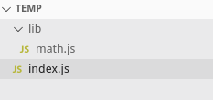
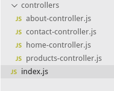
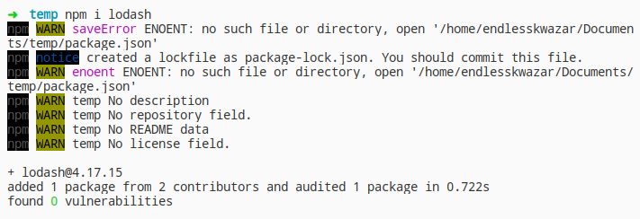
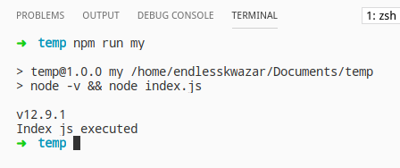

# Promises, async/await, modules


## Callback hell


### Callback hell
Змоделюємо ситуацію, де є три функції. Виклик другої функції залежить від результату виконання першої, а виклик третьої залежить від виконання другої. Всі три функції повинні приймати callback - функцію як параметр.


### Callback hell
```js
first(2, function (firstRes, err) {
  if (!err) {
    console.log(`Exec first callback value ${firstRes}`);
    second(firstRes, function(secondRes, err) {
      if (!err){
        console.log(`Exec second callback value ${secondRes}`);
        third(secondRes, function(thirdRes, err){
          if (!err) {
            console.log(`Exec Third callback value ${thirdRes}`);
          }
        })
      }
    });
  }
});

function first(value, callback) {
  console.log('Executing first func');
  callback(value + 2, false);
}

function second(value, callback) {
  console.log('Executing second func');
  callback(value + 2, false);
}

function third(value, callback) {
  console.log('Executing third func');
  callback(value + 2, false);
}
```


### Callback hell
Ящо ми змінимо 2-гий параметр, виклику cack у якійсь із функцій ланцюжок викликів функцій припиниться:

```js
...
function second(value, callback) {
  console.log('Executing second func');
  callback(value + 2, true);
}
...
```


### Callback hell
Недоліком такого коду є той факт, що із ростом складності код швидко перетворюється в малозрозумілі, багатократно вкладені блоки. Для такого навіть є назва **"callback hell"**.


## Promises


### Promises
**Давайте змоделюємо іншу ситуацію**:

Уявіть, що ви дитина. Ваша мама обіцяє вам, що наступного тижня купить вам новий телефон.

Ви не знаєте, чи отримаєте цей телефон до наступного тижня. Ваша мама може дійсно придбати вам новий телефон або незадоволена вашою успішністю в школі не дотримати обіцянку.


### Promises
**Спочатку реалізуємо це за допомогою callback**:

```js
function byNewPhone(avarageMark, callback) {
  if (avarageMark > 3) {
    const phone = {
      model: "Simens a62"
    }
    callback(phone, null);
  }
  else {
    callback(null, "Mom isn`t happy with your marks!!!");
  }
}

byNewPhone(4, (phone, err) => {
  if(err) {
    console.log("Fuck!!!");
  }
  else {
    console.log("Fuck yeah!!!");
  }
});
```


### Promises
**А тепер розгляньмо інший спосіб реалізації із використанням Promises**.

Promise - це спеціальний об'єкт, який містить зберігає свій стан:
- pending - очікує на розгляд(pending): Ви не знаєте, чи отримаєте цей телефон до наступного тижня.
- resolved - виконана(resolved): ваша мама дійсно купує вам новий телефон.
- rejected - відхилений(rejected): ви не отримуєте новий телефон.


### Promises


### Promises
Переробимо наш приклад, використовуючи проміс:

```js
var isMomHappy = false;

// Promise
var willIGetNewPhone = new Promise(
	function (resolve, reject) {
		if (isMomHappy) {
			var phone = {
				brand: 'Samsung',
				color: 'black'
			};
			resolve(phone); // fulfilled
		} else {
			var reason = new Error('mom is not happy');
			reject(reason); // reject
		}

	}
);

var askMom = function () {
	willIGetNewPhone
		.then(function (phone) {
			console.log(phone);
		})
		.catch(function (error) {
			console.log(error.message);
		});
};

askMom();
```


### Promises
Щоб виконати якийсь код, коли проміс буде resolved потрібно кинути callback в метод then. Якщо ми хочимо виконати код на rejected потрібно кинути callback в rejected.


### Promises
Скажімо, ви, обіцяєте своєму другові, що ви покажете новий телефон, коли ваша мама купить його вам. 


### Promises
```js
var showOff = function (phone) {
	return new Promise(
		function (resolve, reject) {
			var message = 'Hey friend, I have a new ' +
				phone.color + ' ' + phone.brand + ' phone';

			resolve(message);
		}
	);
};

var askMom = function () {
	willIGetNewPhone
	.then(showOff) // chain it here
	.then(function (fulfilled) {
			console.log(fulfilled);
		})
		.catch(function (error) {
			console.log(error.message);
		});
};
```


## Асинхроний JavaScript. async/await


### Асинхроний JavaScript. async/await
Проміси і callbacks за дефолтом не є асинхронними, хоча в javascript існують і асинхронні. Розгляньмо одну із них setTimeout(). setTimeout() - дозволяє виконати відстрочений код без блокування потоку.


### Асинхроний JavaScript. async/await
```js
setTimeout(() => {
  console.log("Callback from setTimeout");
}, 3000);

console.log("Other code");
```


### Асинхроний JavaScript. async/await
Проміси також бувають асинхронні. Давайте створимо такий проміс:

```js
const getResponse = new Promise((resolve, reject) => {
  setTimeout(() => {
    let response = "This is response from server";
    resolve(response);
  }, 2000);
});

getResponse
.then((data) => {
  console.log(data);
})

console.log("Other code");
```


### Асинхроний JavaScript. async/await
Проблема полягає в тому, що ми, люди, не звикли мислити асинхронно. Було б краще якщо б такий код виглядав так:

```js
response = getResponse();
```

Ідея async/await полягає саме в цьому. 


### Асинхроний JavaScript. async/await
Давайте спочатку розглянемо приклад:

```js
const getResponse = function() {
  return new Promise((resolve, reject) => {
  setTimeout(() => {
    let response = "This is response from server";
    resolve(response);
  }, 2000);
});
} 

async function fetchData() {
  console.log("starting fetching data");
  const data = await getResponse();
  console.log(data);
}

fetchData();
```


### Асинхроний JavaScript. async/await
Як бачимо порядок коду став сихроним, якщо ми видалимо async/await ми отримаємо поляману логіку:

```js
const getResponse = function() {
  return new Promise((resolve, reject) => {
  setTimeout(() => {
    let response = "This is response from server";
    resolve(response);
  }, 2000);
});
} 

function fetchData() {
  console.log("starting fetching data");
  const data = getResponse();
  console.log(data);
}

fetchData();
```


### Асинхроний JavaScript. async/await
- Async функції. Які оголошуються додаванням слова async, наприклад ```js async function doAsyncStuff () {... code}```. 
- Ваш код може встати на паузу в очікуванні Async функції з await
- await повертає те, що асинхронна функція віддає при завершенні.
- Await може бути використано тільки всередині async функції.


### Асинхроний JavaScript. async/await
Єдине, що нам залишилося розглянути, а що якщо трапиця помилка, так як від catch на промісі ми відмовилися можна використати блок try...catch:

```js
const getResponse = function() {
  return new Promise((resolve, reject) => {
  setTimeout(() => {
    let response = "This is response from server";
    reject("Error");
  }, 2000);
});
} 

async function fetchData() {
  console.log("starting fetching data");
  try{
      const data = await getResponse();
      console.log(data);
  }
  catch (e){
    console.log(e);
  }
}

fetchData();
```


## Common.js модулі


### Common.js модулі
Довгий час в JavaScript був відсутній синтаксис модулів на рівні мови. Це не було проблемою, тому що перші скрипти були маленькими і простими. У модулях не було необхідності.

Але з часом скрипти ставали все більш і більш складними, тому спільнота придумало кілька варіантів організації коду в модулі. З'явилися бібліотеки для динамічної підвантаження модулів.


### Common.js модулі
наприклад:

- AMD - одна з найстаріших модульних систем, спочатку реалізована бібліотекою require.js.
- CommonJS - модульна система, створена для сервера Node.js.
- UMD - ще одна модульна система, пропонується як універсальна, сумісна з AMD і CommonJS.

Ми розглянемо Common.js модулі так-як вони підтримуються з коробки без ніяких налаштувань.


### Common.js модулі
творимо наступну структуру директорій:




### Common.js модулі
math.js:
```js
const pi = 3.4;
function sum(a, b){
	return a + b;
}
exports.pi = pi;
exports.sum = sum;
```

Якщо нам потрібно експортувати об'єкт із файла, потрібно його просто додати поле в стандартний об'єкт exports після чого його можна буде імпортувати за допомогою require.


### Common.js модулі
index.js:
```js
const math = require('./lib/math')
console.log(math.sum(1,2)); //3
console.log(math.pi); //3.4
```


### Common.js модулі
Оскільки require повертає об'єкт ми можемо використати "Object destructuring":

index.js:
```js
const {sum, pi} = require('./lib/math')
console.log(sum(1,2)); //3
console.log(pi); //3.4
```


### Імпортування черех index.js
Уявіть собі наступну структуру проекту:




### Імпортування черех index.js
В директорії controllers в нас багато файлів. Ось виглядає файл, якому б знадобилося деяка порція цих файлів:

```js
const {aboutController} = require('./controllers/about-controller');
const {contactController} = require('./controllers/contact-controller');
const {homeController} = require('./controllers/home-controller');
const {productsController} = require('./controllers/products-controller');
```


### Імпортування черех index.js
Можна спростити ці імпорти, створивши файл index.js імпортувати всі необхідні модулі і їх експортувати єдиним об'єктам. Так ми зробимо використання коду клієнтами зрочнішим:

controllers/index.js
```js
const {aboutController} = require('./about-controller');
const {contactController} = require('./contact-controller');
const {homeController} = require('./home-controller');
const {productsController} = require('./products-controller');

exports.aboutController = aboutController;
exports.contactController = contactController;
exports.homeController = homeController;
exports.productsController = productsController;
```


### Імпортування черех index.js
Тоді клієнт index.js буде виглядати як:

```js
const {aboutController, homeController} = require('./controllers');
aboutController();
```


## npm


### npm
**npm** - менеджер пакетів, що входить до складу Node.js. Знайти пакети для установки можна на [npmjs](https://www.npmjs.com/).

Установка пакету проводиться за допомогою команди:
```bash
npm install <package_name>
//or
npm i <package_name>
```

Наприклад:
```bash
npm i lodash
```


### npm
 Зверніть увагу на те, що якщо в робочій директорії куди встановлюється пакет не буде ініціалізований npm - проект установка пройде не зовсім хорошо, хоча пакет буде дійсно встановлений.




### npm
Тому краще ініціалізувати проект, використовуючи команду:
```bash
npm init
```


### npm
В процесі буде необхідно ввести наступну інформацію:
- package name - ім'я проекту
- version - версія проекту
- description - опис проекту
- entry point - точка входу
- test command - команда для запуску тестів
- git repository - адреса git - репозиторія
- keywords - ключові слова для пошуку проекту
- author - ім'я, нік автора
- license - ліцензія список ліцензій


### npm
В робочій директорії з'явилися наступні директорії і файли:

- node_modules - директорія в якій знаходяться всі пакети(потрібно додавати в .gitignore)
- package.json - файл опису проекту і його залежностей(не потрібно додавати в .gitignore)
- package-lock.json - package-lock.json використовується виключно для блокування залежностей від певного номера версії.(непотрібно додавати в .gitignore)


### npm
Можна використати наступні ключі для модификації доступності об'єкта від оточення використовувати наступні ключі щоб змінити це:

- Для цілей розробки:

```bash
npm i --save-dev
// or
npm i -D
```

```js
"devDependencies": {
    "lodash": "^4.17.15"
  }
```


### npm
- Для продакшн

```npm
npm i --save-prod
// or
npm i -P
```

```js
"dependencies": {
  "lodash": "^4.17.15"
}
```


### npm
Щоб використати завантажений пакет його достатньо імпортувати:
```js
var _ = require('lodash');
```


### npm
Якщо Ви помітили package.json містить перелік пакетів і їх версій від, яких залежить наш проект.

Номер версії є синтаксисом semver, який позначає кожен розділ з різним значенням. semver розбивається на три секції, розділені крапкою.

```
major.minor.patch
1.0.2
```


### npm
Перед номером версій можуть ставитися символи:

- '~' - це означає встановити версію 1.0.2 або останню версію патча, таку як 1.0.4.
- '^' - це означає встановити версію 1.0.2 або останню мінорну або виправлену версію, таку як 1.1.0.


## start scripts


### start scripts
npm містить поле під назвою scripts в файлі package.json проекту для того, щоб робити такі команди, як npm test, фактично, виконує вміст поля scripts.test, і npm start, що викликає інструкції з поля scripts. start.


### start scripts
Створимо власний скрипт під назвою my:
```js
...
"scripts": {
  "test": "echo \"Error: no test specified\" && exit 1",
  "my": "node -v && node index.js"
}
...
```


### start scripts
Запустимо цей скрипт за допомогою команди:
```bash
npm run my
```

