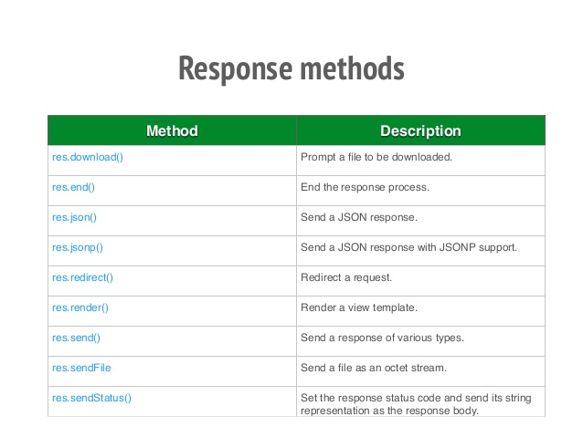
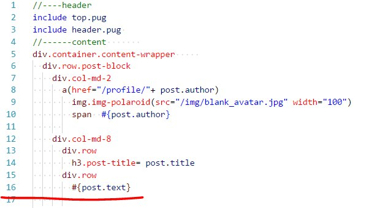

## Express.js


### Express.js
- Express.js, or simply Express, is a web application framework for Node.js, released as free and open-source software under the MIT License. It is designed for building web applications and APIs.
- It has been called the de facto standard server framework for Node.js.
- The original author, TJ Holowaychuk, described it as a Sinatra-inspired server, meaning that it is relatively minimal with many features available as plugins.


## Express. Install


### Express. Install. Use

```bash
$ mkdir myapp
$ cd myapp
$ npm init
entry point: (index.js)
$ npm install express --save
```


### Express. Install. Use
//index.js
```js
var express = require('express');
var app = express();

app.get('/', function(req, res) {
    res.send('hello world');
});

var server = app.listen(8081, function(){
    var host = server.address().address
    var port = server.address().port

console.log("Example app listening at http://%s:%s", host, port)
});
```


### Express. Install. Use




### Express. Use

```js
app.get('/users/:userId/books/:bookId', function (req, res) {
  //req.params.userId
  //req.params.bookId
  res.send(req.params);
})
```


## Express. Modular routes


### Express. Modular routes
- Express 4.0 comes with the new Router. Router is like a mini express application. It doesn't bring in views or settings, but provides us with the routing APIs like .use, .get, .param, and route


### Express. Modular routes
routes/index.js
```js
var express = require('express');
var router = express.Router();

router.get('/', function(req, res){
	res.send('This is index page');
})

module.exports.router = router;
```


### Express. Modular routes
index.js
```js
var express = require('express');
var {router} = require('./routes');
var app = express();
app.use(router);


var server = app.listen(8081, function(){
	var host = server.address().address
	var port = server.address().port

console.log("Example app listening at http://%s:%s", host, port)
});
```


## Express. Controllers


### Express. Controllers
```js
//controllers/index-controller.js
module.exports.indexController = (req, res) => {
	res.send('This is index page');
}

//controllers/index.js
var {indexController} = require('./index-controller');

module.exports.indexController = indexController;
```


### Express. Controllers
```js
//routes/index.js
var express = require('express');
var router = express.Router();
var controllers = require('../controllers');

router.get('/', controllers.indexController);

module.exports.router = router;
```


## Express. Views and templating


### Express. Views and templating
Express doesnt have a default view engine. You can choose any from npm. Popular one is:

- pug
- handlebars
- ejs


### Express. Views and templating
pug:




### Express. Installing handlebars
```js
npm install --save express-handlebars
```

[handlebarsjs](https://handlebarsjs.com/)


### Express. Using handlebars
```js
var exphbs  = require('express-handlebars');

app.engine('handlebars', exphbs({defaultLayout: 'main'}));
app.set('view engine', 'handlebars');
```


### demo app
- [node-js-examples](https://github.com/endlesskwazar/node-js-examples.git)
- branch: express
