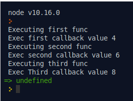

# Callbacks example

Змоделюємо ситуацію, де є три функції. Виклик другої функції залежить від результату виконання першої, а виклик третьої залежить від виконання другої. Всі три функції повинні приймати callback - функцію як параметр.

Подивимося на код, який це ілюструє:

```js
first(2, function (firstRes, err) {
  if (!err) {
    console.log(`Exec first callback value ${firstRes}`);
    second(firstRes, function(secondRes, err) {
      if (!err){
        console.log(`Exec second callback value ${secondRes}`);
        third(secondRes, function(thirdRes, err){
          if (!err) {
            console.log(`Exec Third callback value ${thirdRes}`);
          }
        })
      }
    });
  }
});

function first(value, callback) {
  console.log('Executing first func');
  callback(value + 2, false);
}

function second(value, callback) {
  console.log('Executing second func');
  callback(value + 2, false);
}

function third(value, callback) {
  console.log('Executing third func');
  callback(value + 2, false);
}
```



Ящо ми змінимо 2-гий параметр, виклику cack у якійсь із функцій ланцюжок викликів функцій припиниться:

```js
...
function second(value, callback) {
  console.log('Executing second func');
  callback(value + 2, true);
}
...
```


Недоліком такого коду є той факт, що із ростом складності код швидко перетворюється в малозрозумілі, багатократно вкладені блоки. Для такого навіть є назва **"callback hell"**.

# Promises

# Асинхроний JavaScript. async/await

# Common.js модулі

# ES6 модулі