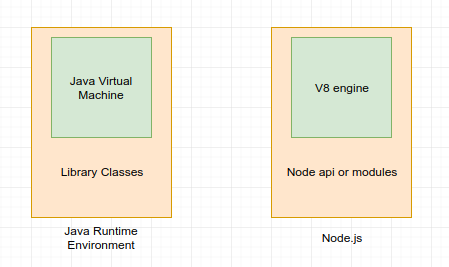
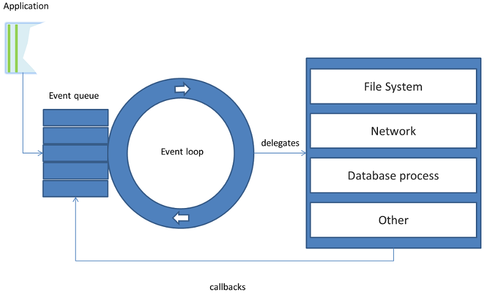
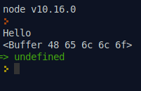

# Зміст

${toc}

# HTTP - протокол

**HTTP** - це протокол, що дозволяє отримувати різні ресурси, наприклад HTML-документи. Протокол HTTP лежить в основі обміну даними в Інтернеті. HTTP є протоколом клієнт-серверної взаємодії, що означає ініціювання запитів до сервера самим одержувачем, зазвичай веб-браузером. Отриманий підсумковий документ буде реконструйований з різних суб - документів, наприклад, з окремо отриманого тексту, опису структури документа, зображень, відео-файлів, скриптів і багато чого іншого.

Абревіатура HTTP розшифровується як HyperText Transfer Protocol, «протокол передачі гіпертексту». Відповідно до специфікації OSI, HTTP є протоколом прикладного (верхнього, 7-го) рівня. Актуальна на даний момент версія протоколу, HTTP 1.1, описана в специфікації RFC 2616.

Розробником протоколу HTTP був британський вчений і співробітник ЦЕРН Тім Бернерс-Лі - ідеолог створення "всесвітньої павутини". Робота над створенням протоколу тривала близько двох років і вже в березні 1991 року було розпочато використання протоколу, як механізму для доступу до документів в Інтернеті і полегшення навігації за допомогою використання гіпертексту.

Клієнти і сервери взаємодіють, обмінюючись індивідуальними повідомленнями. Повідомлення, відправлені клієнтом, зазвичай веб-браузером, називаються запитами, а повідомлення, відправлені сервером, називаються відповідями.


Хоча HTTP був розроблений ще на початку 1990-х років, за рахунок своєї розширюваності надалі він весь час удосконалювався. HTTP є протоколом прикладного рівня, який найчастіше використовує можливості іншого протоколу - TCP (або TLS - захищений TCP) - для пересилання своїх повідомлень, проте будь-який інший надійний транспортний протокол теоретично може бути використаний для доставки таких повідомлень. Завдяки своїй розширюваності, він використовується не тільки для отримання клієнтом гіпертекстових документів або зображень і відео, але і для передачі контенту серверів, наприклад, за допомогою HTML-форм. HTTP також може бути використаний для отримання тільки частин документа з метою поновлення веб-сторінки за запитом.


Для того, щоб сформувати HTTP - запит, необхідно скласти стартовий рядок, а також задати принаймні один заголовок - це заголовок Host, який є обов'язковим, і повинен бути присутнім в кожному запиті. Справа в тому, що перетворення доменного імені в IP-адресу здійснюється на стороні клієнта, і, відповідно, коли ви відкриваєте TCP - з'єднання, то віддалений сервер не володіє жодною інформацією про те, яка саме адреса використовувалася для з'єднання: це міг бути, наприклад , адреса alizar.habrahabr.ru, habrahabr.ru або m.habrahabr.ru - і у всіх цих випадках відповідь може відрізнятися. Однак фактично мережеве з'єднання у всіх випадках відкривається з вузлом 212.24.43.44, і навіть якщо спочатку при відкритті з'єднання була поставлено не ця IP-адреса, а будь-яке доменне ім'я, то сервер про це не інформується - і саме тому цю адресу необхідно передати в заголовку Host.

Стартова (початкова) рядок запиту для HTTP 1.1 складається за такою схемою:
```
Метод URI HTTP/Версія
```

Наприклад (такий стартовий рядок може вказувати на те, що запитується головна сторінка сайту):
```
GET / HTTP/1.1
```

Метод HTTP (англ. HTTP Method) - послідовність з будь-яких символів, крім керуючих і роздільників, яка вказує на основну операцію над ресурсом. Зазвичай метод являє собою короткий англійське слово, записане великими літерами. Зверніть увагу, що назва методу чутливе до регістру.

Сервер може використовувати будь-які методи, не існує обов'язкових методів для сервера або клієнта. Якщо сервер не розпізнав вказаний клієнтом метод, то він повинен повернути статус 501 (Not Implemented). Якщо серверу метод відомий, але він непридатний до конкретного ресурсу, то повертається повідомлення з кодом 405 (Method Not Allowed). В обох випадках сервера слід включити в повідомлення відповіді заголовок Allow зі списком підтримуваних методів.

|Метод|Пояснення|
|-|-|
|GET|Метод GET запитує представлення ресурса. Запити з використанням цього методу можуть тільки отримувати дані.|
|HEAD|HEAD запитує ресурс так само, як і метод GET, але без тіла відповіді.|
|POST|POST використовується для відправки сутностей до певного ресурсу. Часто викликає зміна стану або якісь побічні ефекти на сервері.|
|PUT|PUT замінює всі поточні уявлення ресурсу даними запиту.|
|DELETE|DELETE видаляє вказаний ресурс.
|CONNECT|CONNECT встановлює "тунель" до сервера, визначеному по ресурсу.|
|OPTIONS|OPTIONS використовується для опису параметрів з'єднання з ресурсом.|
|TRACE |TRACE виконує виклик повертається тестового повідомлення з ресурсу.|
|PATCH |PATCH використовується для часткової зміни ресурсу.|

URI (Uniform Resource Identifier, уніфікований ідентифікатор ресурсу) - шлях до конкретного ресурсу (наприклад, документа), над яким необхідно здійснити операцію (наприклад, в разі використання методу GET мається на увазі отримання ресурсу). Деякі запити можуть не ставитися до будь-якого ресурсу, в цьому випадку замість URI в стартову рядок може бути додана зірочка (Астеріск, символ «*»). Наприклад, це може бути запит, який відноситься до самого веб-сервера, а не якого-небудь конкретного ресурсу. В цьому випадку стартова рядок може виглядати так:

```
OPTIONS * HTTP/1.1
```

Для того, щоб звернутися до веб-сторінки по визначеному адресу (в даному випадку шлях до ресурсу - це «/»), нам слід відправити наступний запит:

```
GET / HTTP/1.1
Host: alizar.habrahabr.ru 
```

## Яу розуміти відповідь

Стартовий рядок відповіді має наступну структуру:

```
HTTP / Версія Код стану Пояснення
```

Версія протоколу тут задається так само, як в запиті.

**Код стану (Status Code)** - три цифри (перша з яких вказує на клас стану), які визначають результат здійснення запиту. Наприклад, в разі, якщо був використаний метод GET, і сервер надає ресурс із зазначеним ідентифікатором, то такий стан задається за допомогою коду 200. Якщо сервер повідомляє про те, що такого ресурсу не існує - 404. Якщо сервер повідомляє про те, що не може надати доступ до цього ресурсу через відсутність необхідних привілеїв у клієнта, то використовується код 403. Специфікація HTTP 1.1 визначає 40 різних кодів HTTP, а також допускається розширення протоколу і використання додаткових кодів станів.

Список кодів можна переглянути [тут](https://developer.mozilla.org/ru/docs/Web/HTTP/Status)

Пояснення до коду стану (Reason Phrase) - текстове пояснення до коду відповіді, призначене для спрощення читання відповіді людиною. Пояснення може не враховуватися клієнтським програмним забезпеченням, а також може відрізнятися від стандартного в деяких реалізаціях серверного програмного забезпечення.

Після стартового рядка слідують заголовки, а також тіло відповіді. наприклад:

```
HTTP/1.1 200 OK
Server: nginx/1.2.1
Date: Sat, 08 Mar 2014 22:53:46 GMT
Content-Type: application/octet-stream
Content-Length: 7
Last-Modified: Sat, 08 Mar 2014 22:53:30 GMT
Connection: keep-alive Accept-Ranges: bytes


Wisdom 
```

Тіло відповіді слідує через два розриву рядків після останнього заголовка. Для визначення закінчення тіла відповіді використовується значення заголовка Content-Length (в даному випадку відповідь містить 7 вісімкових байтів: слово «Wisdom» і символ розриву рядків).

Але ось по тому запитові, який ми склали раніше, веб-сервер поверне відповідь не з кодом 200, а з кодом 302. Таким чином він повідомляє клієнту про те, що звертатися до даного ресурсу на даний момент потрібно за іншою адресою.

```
HTTP/1.1 302 Moved Temporarily
Server: nginx
Date: Sat, 08 Mar 2014 22:29:53 GMT
Content-Type: text/html
Content-Length: 154
Connection: keep-alive
Keep-Alive: timeout=25
Location: http://habrahabr.ru/users/alizar/


<html>
<head><title>302 Found</title></head>
<body bgcolor="white">
<center><h1>302 Found</h1></center>
<hr><center>nginx</center>
</body>
</html>
```

У заголовку Location передано нову адресу. Тепер URI (ідентифікатор ресурсу) змінився на / users / alizar /, а звертатися потрібно на цей раз до сервера за адресою habrahabr.ru (втім, в даному випадку це той же самий сервер), і його ж вказувати в заголовку Host.

# Модель Node.js

Оточення Node.js включає все, що вам потрібно для виконання програми, написаної на JavaScript.



**Перший основний тезис Node.js** полягає в тому, що операції введення / виводу обходяться дорого:


Взагалі, це найбільше марнотратство в сучасному програмуванні - чекати, поки завершиться операція введення / виводу (I / O). Ось деякі підходи, які існують у веб - програмуванні:

- **синхронні операції**: за раз ви обробляєте тільки один запит, обробка запитів відбувається в порядку черги. Плюси: простота. Мінуси: Будь-який запит може заблокувати обробку всіх інших.
- **Створення нового процесу:** кожен раз ви запускаєте новий процес для обробки нового запиту. Плюси: простота. Мінуси: fork () - це молоток unix-програмістів. Він простий в застосуванні, а кожна проблема завжди схожа на цвях. Зазвичай такий підхід призводить до поганої масштабованості. Все таки, сотні відкритих підключень - це сотні запущених процесів.
- **Потоки:** Ви обробляєте кожен запит в окремому тред. Плюси: Простота. На відміну від fork (), для запуску тред потрібно менше ресурсів. Мінуси: Ваш комп'ютер може не підтримувати роботу з тред. Крім того, програмування тредов дуже швидко стає головним болем: доводиться постійно турбуватися про проблеми доступу до загальних ресурсів.

**Другий основний тез** полягає в тому, що обробка кожного нового підключення в окремому треді призводить до великих витрат пам'яті. Наприклад, Apache, працюючи з тред, споживає набагато більше пам'яті, ніж Nginx.

Node.js використовує один потік для виконання всього вашого коду, тим не менш, все, крім вашого коду, запускається паралельно. Така модель називається "single-threaded non-blocking asynchronous".

Асинхроність досягається за допомогою "event loop":



# Модуль FS

Якщо ви хочете зробити веб-сервер на Node.js або просто якийсь додаток, тоді вам потрібно вміти читати файли. Node надає бібліотеку **fs** для роботи з файловою системою.

Для роботи із модулем його потрібно підключити:

```js
var fs = require('fs');
```

## Асинхронні функції

"Нормальний" спосіб читання/запису файлів в Node.js це асинхронни1 способом. Це означає, що ви викликаєте команду читання або запису файлу і передаєте callback, який буде викликаний при завершенні. Це дозволяє працювати з декількома запитами паралельно.

### readFile

Використовуйте метод fs.readFile () для асинхронного читання фізичного файлу.

```js
fs.readFile(fileName [,options], callback)
```

де:

- fileName: повний шлях та ім'я файлу у вигляді рядка.
- options: може бути об'єктом або рядком, який може включати кодування та прапор. Кодування за замовчуванням utf8, а прапор за замовчуванням - "r".
- callback: функція з двома параметрами err та fd. Буде викликана, коли операція readFile завершиться.

```js
var fs = require('fs');

fs.readFile('text.txt', 'utf-8', (err, data) => {
  if(err) {
    console.log(err);
  }
  else {
    console.log(data);
  }
});

fs.readFile('text.txt', (err, data) => {
  if(err) {
    console.log(err);
  }
  else {
    console.log(data);
  }
});
```



### writefile

Використовуйте метод fs.writeFile () для запису даних у файл. Якщо файл вже існує, він перезаписує вміст, інакше він створює новий файл і записує в нього дані.

```js
fs.writeFile(filename, data[, options], callback)
```

де:
- filename: повний шлях та ім'я файлу у вигляді рядка.
- data: вміст, який слід записати у файл.
- options: Параметр параметрів може бути об'єктом або рядком, який може включати кодування, режим та прапор. Кодування за замовчуванням - utf8, а прапор за замовчуванням - "r".
- callback: функція з двома параметрами err та fd. Це буде викликано, коли операція запису завершиться.

```js
var fs = require('fs');

const text = `Some text`;

fs.writeFile('text.txt', text, (err) => {
  if(err){
    console.log('Cant write');
  }
});
```

### appendFile

Функція fs,appendFile() аналогічна writeFile(), крім того, що вона не перезаписує вміст фуйлу.

### Основні функції fs

|Функція|Пояснення|
|-|-|
|fs.readFile(fileName [,options], callback)|Читає наявний файл.|
|fs.writeFile(filename, data[, options], callback)|Записується у файл. Якщо файл існує, тоді перезаписує вміст, інакше створюється новий файл.|
|fs.open(path, flags[, mode], callback)|Відкриває файл для читання чи запису.|
|fs.rename(oldPath, newPath, callback)|Перейменовує існуючий файл.|
|fs.chown(path, uid, gid, callback)|Асинхронний chown.|
|fs.stat(path, callback)|Повертає об'єкт fs.stat, який включає важливу статистику файлів.|
|fs.rmdir(path, callback) |Перейменовує існуючий каталог.|
|fs.mkdir(path[, mode], callback) |Створює новий каталог.|
|fs.readdir(path, callback) |Читає вміст вказаного каталогу.|
|fs.exists(path, callback) |Визначає, існує вказаний файл чи ні.|
|fs.access(path[, mode], callback) |Тестує дозволи користувача на вказаний файл.|
|fs.appendFile(file, data[, options], callback) |Додає новий вміст до наявного файлу.|

## Синхронні функції

Крім "нормальних" асинхронних модуль fs містить синхронні функції:

|Асинхронна|Синхронна|
|-|-|
|readFile()|readFileSync()|
|writeFile()|writeFileSync()|
|appendFile()|appendFileSync()|

і т.д.

# Модуль HTTP

Node.js має вбудований модуль під назвою HTTP, який дозволяє Node.js передавати дані через протокол передачі гіпертексту (HTTP).

Підключення модуля:

```js
var http = require('http'); 
```

## Вбудований сервер

Модуль HTTP може створити сервер HTTP, який прослуховує порти сервера і повертає відповідь клієнту.

```js
http.createServer(function(req, res){
	res.write('Hello world');
	res.end();
}).listen(8080);
```

Функція createServer приймає callback, який може бути і не анонімним:

```js
const handler = (req, res) => {
	res.write('Hello worlds');
	res.end();
};

http.createServer(handler).listen(8080);
```

Функція write може ввідавати HTML:

```js
res.write('<h1>Hello World</h1>');
```

## Simple routing

Усі URL-адреси для localhost передаються одній функції зворотного виклику. Для написання логіки маршрутизації використовуйте req.url і req.method:

```js
const http = require('http');

http.createServer((req, res) => {

    console.log(`req.url == ${req.url} req.method == ${req.method}`);

    if(req.url == '/about' && req.method == 'GET'){
        res.write('Res from about page, method GET');
        res.end();
    }
    else {
        if (req.url == '/contact' && req.method == 'GET' ) {
            res.write('Res from contact page, method GET');
            res.end();
        }
    }

    res.write('HTTP 404: Not Found');
	  res.end();

}).listen(8000);
```

## Повернення HTML - файлу у відповідь

Для того, щоб повернути html - файл у відповідь достатньо його прочитати і повернути текстовий вміст:

about.html:
```html
<!DOCTYPE html>
<html lang="en">
<head>
    <meta charset="UTF-8">
    <meta name="viewport" content="width=device-width, initial-scale=1.0">
    <meta http-equiv="X-UA-Compatible" content="ie=edge">
    <title>About</title>
</head>
<body>
    <h1>This is about page</h1>
</body>
</html>
```

```js
const http = require('http');
const fs = require('fs');

http.createServer((req, res) => {

    console.log(`req.url == ${req.url} req.method == ${req.method}`);

    if(req.url == '/about' && req.method == 'GET'){
        fs.readFile('about.html', 'utf-8', (err, data) => {
            if (err) {
                console.log(err);
            }

            res.write(data);
            res.end();
        });
        
    }
    else {
        if (req.url == '/contact' && req.method == 'GET' ) {
            res.write('Res from contact page, method GET');
            res.end();
        }
    }

    res.write('HTTP 404: Not Found');
    res.end();
}).listen(8000);
```

## nodemon

Якщо ми запустимо сервер через команду node і внеемо зміни в джерельний код, то ці зміни будуть застосовані лише, коли сервер буде перезавантажений. Це не дуже зручно при розробці, оскільки доводеться зупиняти і замускати сервер кожного разу, коли змінився джерельний код. Для зручності, при розробці можна використовувати nodemon.

Для встановлення nodemon глобально можа:

```
npm install -g nodemon
```

або встановити як dev - залежність:

```
npm install --save-dev nodemon
```

Якщо nodemon був встановлений глобально запустити можна так:
```
nodemon [your node app]
```

Якщо локально, то:

```

```

або створити скрипт в package.json

```js
"scripts": {
    "test": "echo \"Error: no test specified\" && exit 1",
    "start-dev": "nodemon index.js"
  },
```

```
npm run start-dev
```

Або і взагалі без встановлення, використовуючи npx:
```
npx nodemon [app]
```

## Читання GET і POST - параметрів


# Example project


# Домашнє завдання

# Контрольні запитання

1. Що таке HTTP - протокол?
2. Як працює Node.js?
3. Для чого потрібено модуль fs, як його підключити?
4. Поясніть функція readFile().
5. Поясніть функцію writeFile() і appendFile().
6. Яка різниця між readFile() і readFileSync()?
7. Для чого використовується модуль http?
8. Поясніть функцію http.createServer().