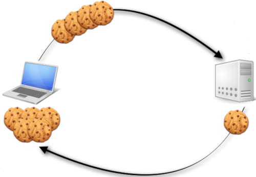
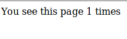
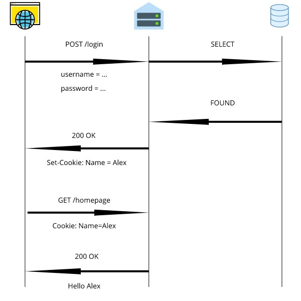

# Зміст

${toc}

# Cookie

Cookie (кукі) представляють невеликі набори даних (не більше 4 кбайт), за допомогою яких веб-сайт може зберегти на комп'ютері користувача будь-яку інформацію.



Для встановлення cookie сервер клієнтові вдправляє необхідний заголок. Кожного разу, коли клієнт відправляє запит на сервер, він відправляґ всі встановлені cookie.

Для чого використовуються cookie:

- сесія
- персоналізаці(рекомендації користувачам)
- відслідковування користувачів

## Express cookie

Для того щоб працювати із cookie потрібно встановити пакет cookie-parser:

```bash
npm install cookie-parser
```

cookie-parser - це middleware:

```js
var express = require('express')
var cookieParser = require('cookie-parser')

var app = express()
app.use(cookieParser())
```

cookie-parser додає до об'єкта response функцыю cookie, яка може бути використана для встановлення cookie:

```js
res.cookie('cookieName', 'cookieValue')
```

Також cookie-parser додає масив cookies до об'єкта request для того, щоб прочитати всі встановлені cookies:

```js
req.cookies
```

Приклад:

```js
var express = require('express')
var cookieParser = require('cookie-parser')

var app = express()
app.use(cookieParser())

app.get('/', function(req, res) {
    let counter = req.cookies['counter'] ? req.cookies['counter'] : 1;
    res.cookie('counter', ++counter); //order matters send after set cookies
    res.send(`You see this page ${--counter} times`);
});

app.listen(3000);
```



## Express auth using cookie



- [node-js-examples](https://github.com/endlesskwazar/node-js-examples)
- branch - express-cookie-auth

# Session

## Express session

## Express auth using session

# Password encryption

## Express auth using password encryption

# Домашнє завдання

# Контрольні запитання