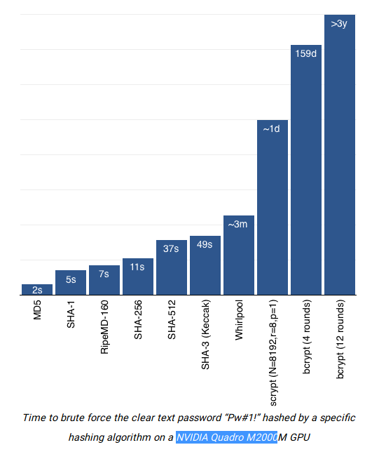
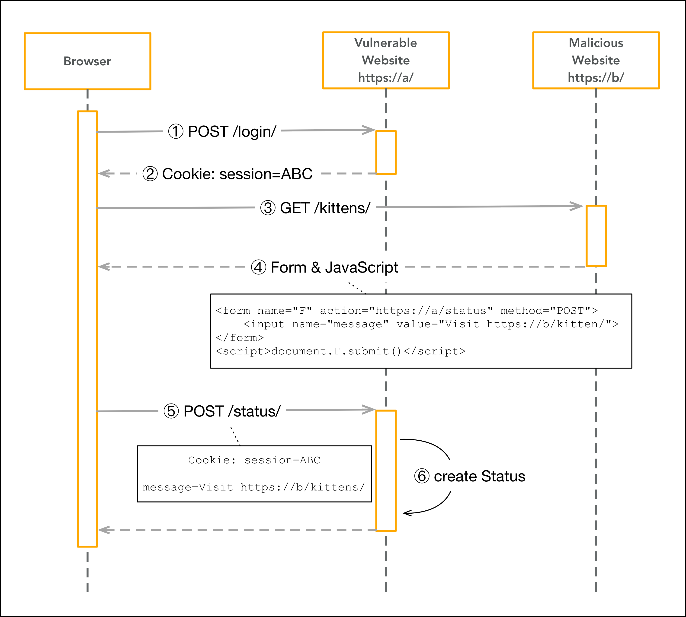

# Зміст

${toc}

# Cookie

Cookie (кукі) представляють невеликі набори даних (не більше 4 кбайт), за допомогою яких веб-сайт може зберегти на комп'ютері користувача будь-яку інформацію.


Для встановлення cookie сервер клієнтові вдправляє необхідний заголок. Кожного разу, коли клієнт відправляє запит на сервер, він відправляґ всі встановлені cookie.

Для чого використовуються cookie:

- сесія
- персоналізаці(рекомендації користувачам)
- відслідковування користувачів

## Express cookie

Для того щоб працювати із cookie потрібно встановити пакет cookie-parser:

```bash
npm install cookie-parser
```

cookie-parser - це middleware:

```js
var express = require('express')
var cookieParser = require('cookie-parser')

var app = express()
app.use(cookieParser())
```

cookie-parser додає до об'єкта response функцыю cookie, яка може бути використана для встановлення cookie:

```js
res.cookie('cookieName', 'cookieValue')
```

Також cookie-parser додає масив cookies до об'єкта request для того, щоб прочитати всі встановлені cookies:

```js
req.cookies
```

Приклад:

```js
var express = require('express')
var cookieParser = require('cookie-parser')

var app = express()
app.use(cookieParser())

app.get('/', function(req, res) {
    let counter = req.cookies['counter'] ? req.cookies['counter'] : 1;
    res.cookie('counter', ++counter); //order matters send after set cookies
    res.send(`You see this page ${--counter} times`);
});

app.listen(3000);
```


## Express auth using cookie


- [node-js-examples](https://github.com/endlesskwazar/node-js-examples)
- branch - express-cookie-auth

# Session

HTTP протокол - stateless; щоб пов’язати запит з будь-яким іншим запитом, вам потрібен спосіб зберігання даних користувачів між HTTP-запитами. Файли cookie та параметри URL є придатними способами транспортування даних між клієнтом та сервером. Але вони читаються і на стороні клієнта. Сесії вирішують саме цю проблему. Ви присвоюєте клієнту ідентифікатор, і він робить усі подальші запити, використовуючи цей ідентифікатор. Інформація, пов'язана з клієнтом, зберігається на сервері, пов'язаному з цим ідентифікатором.

## Express session

Для того, щоб використовувати сесію в express потрібно встановити пакет express-session:

```bash
npm i express-session
```

Приклад:

```js
var express = require('express');
var session = require('express-session');
var app = express();

var sess = {
    secret: 'keyboard cat',
    resave: true,
    saveUninitialized: true,
    cookie: {}
};

if (app.get('env') === 'production') {
    app.set('trust proxy', 1) // trust first proxy
    sess.cookie.secure = true // serve secure cookies
};

app.use(session(sess));

app.get('/', function(req, res) {
    let counter = req.session.counter ? req.session.counter : 1;
    req.session.counter = ++counter;
    res.send(`You see this page ${--counter} times`);
});

app.listen('3000');
```

## Express auth using session


- [node-js-examples](https://github.com/endlesskwazar/node-js-examples)
- branch - express-session-auth

# Password encryption

## Plaintext

Коли постало питання зберігання паролів, звичайно, першою ідеєю було просто записувати їх у відкритому вигляді у відповідній табличці в базі даних. І все б нічого, якби доступ до неї дійсно безпосередньо клієнти отримати не могли. Але, на жаль, в різних веб-додатках і раніше іноді працює така відома всім SQL-ін'єкція, не кажучи вже про інших потенційних вразливості. У питаннях безпеки взагалі прийнято припускати найгірше і готувати план дій і захист навіть на такий випадок. Будемо вважати, що зловмисник знайшов в веб-додатку лазівку, тим або іншим способом радісно вивантажує собі таблицю з іменами і паролями користувачів і далі вже розпоряджається ними, як йому заманеться.

## Шифрування vs Хешування

Хорошо було б зберігати паролі в зашифрованому вигляді. Тоді, навіть якщо їх отримають, відновити не зможуть або, витратять на це занадто багато часу. Тут вибір встає між двома гілками розвитку: шифрувати паролі або хешувати.

**Хешування** - це одностороння функція (ну, відображення). Це необоротно, ви застосовуєте алгоритм безпечного хеша, і ви не можете повернути вихідний рядок. Найбільше, що ви можете зробити, це генерувати те, що називається "зіткненням", тобто знаходити інший рядок, яка забезпечує той же хеш.

**Шифрування** є правильною функцією. Ви можете розшифрувати спотворений рядок, щоб отримати вихідний рядок, якщо у вас є ключ.

Порівняльний аналіз:

- Трудомісткість. Шифрування може тривати довше, а яке перетворення ми б не вибрали, його доведеться проробляти при кожній перевірці пароля. Однією з вимог до хеш-функцій ж є швидкість виконання.
- Довжина вихідних значень. Результат шифрування має змінну довжину, результат хешування - завжди однакову, а зберігати однорідні за розміром дані в базі даних дуже вже зручно. Не кажучи вже про те, що довжина пароля в зашифрованому вигляді буде давати деяку інформацію про довжину вихідного пароля. Однакова довжина, правда, призводить до можливості виникнення колізій, але про це нижче.
- Управління ключами. Для шифрування потрібно ключ, який теж десь доведеться зберігати і сподіватися, що його ніхто не знайде. У будь-якому випадку, генерація і управління ключами це окрема історія (вони не повинні бути слабкими, їх потрібно регулярно міняти і так далі).
- Можливість колізії. При шифруванні вихідні дані від різних вхідних даних завжди теж будуть різні. При хешування ж це не завжди так. Постійна довжина хеша означає обмеженість безлічі вихідних значень хеш-функції, що призводить до можливості колізії. Тобто, припустимо, користувач дійсно заморочили і придумав собі по-справжньому класний довгий пароль, в якому є і спецсимволи, і цифри, і букви в нижньому і верхньому регістрі. Зловмисник вводить в поле пароля не менше класний пароль "admin". Сервер для перевірки і порівняння хеш захешіровал його. Хеши збіглися. Прикро.

## Вибір хеш - функції

Функція, яка втілює алгоритм і виконує перетворення, називається «хеш-функцією» або «функцією згортки». Вхідні дані називаються вхідним масивом, «ключем» або «повідомленням». Результат перетворення (вихідні дані) називається «хешем», «хеш-кодом», «хеш-сумою», «зведенням повідомлення».


Із популярних алгоритмів хешування паролів: [MD5](https://uk.wikipedia.org/wiki/MD5), [SHA-1](https://uk.wikipedia.org/wiki/SHA-1), [SHA-256](https://uk.wikipedia.org/wiki/SHA-2), [SHA-512](https://uk.wikipedia.org/wiki/SHA-2), [SHA-3 (Keccak)](https://uk.wikipedia.org/wiki/SHA-3), [RipeMD-160](https://ru.wikipedia.org/wiki/RIPEMD), [Whirlpool](https://uk.wikipedia.org/wiki/Whirlpool_(%D0%BA%D1%80%D0%B8%D0%BF%D1%82%D0%BE%D0%B3%D1%80%D0%B0%D1%84%D1%96%D1%8F)), [scrypt (N=8192, r=8, p=1)](https://uk.wikipedia.org/wiki/Scrypt), [bcrypt (4 expansion rounds)](https://uk.wikipedia.org/wiki/Bcrypt), [bcrypt (12 expansion rounds)](https://uk.wikipedia.org/wiki/Bcrypt)

Наведена нижче логарифмічна діаграма відображає час, необхідний взлому пароля в залежності від вибраного алгоритму хешування.




## Express auth using password encryption and database

- [node-js-examples](https://github.com/endlesskwazar/node-js-examples)
- branch - sq-auth

# CSRF

Міжсайтова підробка запиту (англ. Cross-Site Request Forgery, CSRF) — тип веб-атаки, що призводить до виконання певних дій від імені користувача на веб-сторінці де останній аутентифікований. Головною метою CSRF-атаки є підробка запитів, а не викрадення даних, тому що зазвичай зловмисник не має змоги побачити відповідь на підроблений запит.




## Кінцевий проект

- [node-js-examples](https://github.com/endlesskwazar/node-js-examples)
- branch books

# Домашнє завдання

Використовуючи 2 сутності із Вашої теми по ОБДЗ, реалізуйте CRUD - операції, використовуючи express, sequelize. В розробленому додатку повинна бути реалізована система авторизації/реєстрації.

# Контрольні запитання

1. Що таке cookie?
2. Що таке сесія?
3. Поясніть принцип реалізації авторизації на основі сесії?
4. Що таке хешування, навіщо хешувати пароль?
5. Перелічіть алгоритми хешування паролів, які Ви знаєте.