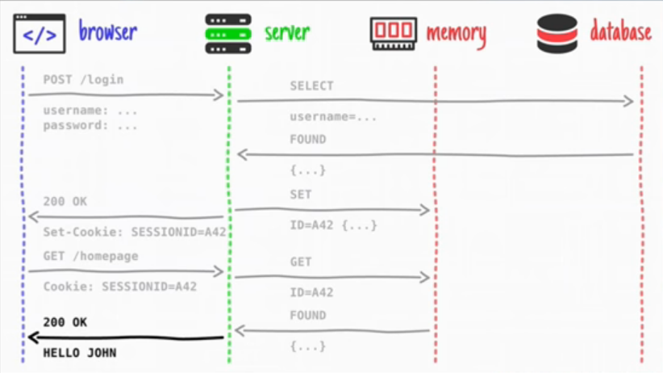

# Зміст

${toc}

# Cookie

Cookie (кукі) представляють невеликі набори даних (не більше 4 кбайт), за допомогою яких веб-сайт може зберегти на комп'ютері користувача будь-яку інформацію.


Для встановлення cookie сервер клієнтові вдправляє необхідний заголок. Кожного разу, коли клієнт відправляє запит на сервер, він відправляґ всі встановлені cookie.

Для чого використовуються cookie:

- сесія
- персоналізаці(рекомендації користувачам)
- відслідковування користувачів

## Express cookie

Для того щоб працювати із cookie потрібно встановити пакет cookie-parser:

```bash
npm install cookie-parser
```

cookie-parser - це middleware:

```js
var express = require('express')
var cookieParser = require('cookie-parser')

var app = express()
app.use(cookieParser())
```

cookie-parser додає до об'єкта response функцыю cookie, яка може бути використана для встановлення cookie:

```js
res.cookie('cookieName', 'cookieValue')
```

Також cookie-parser додає масив cookies до об'єкта request для того, щоб прочитати всі встановлені cookies:

```js
req.cookies
```

Приклад:

```js
var express = require('express')
var cookieParser = require('cookie-parser')

var app = express()
app.use(cookieParser())

app.get('/', function(req, res) {
    let counter = req.cookies['counter'] ? req.cookies['counter'] : 1;
    res.cookie('counter', ++counter); //order matters send after set cookies
    res.send(`You see this page ${--counter} times`);
});

app.listen(3000);
```


## Express auth using cookie


- [node-js-examples](https://github.com/endlesskwazar/node-js-examples)
- branch - express-cookie-auth

# Session

HTTP протокол - stateless; щоб пов’язати запит з будь-яким іншим запитом, вам потрібен спосіб зберігання даних користувачів між HTTP-запитами. Файли cookie та параметри URL є придатними способами транспортування даних між клієнтом та сервером. Але вони читаються і на стороні клієнта. Сесії вирішують саме цю проблему. Ви присвоюєте клієнту ідентифікатор, і він робить усі подальші запити, використовуючи цей ідентифікатор. Інформація, пов'язана з клієнтом, зберігається на сервері, пов'язаному з цим ідентифікатором.

## Express session

Для того, щоб використовувати сесію в express потрібно встановити пакет express-session:

```bash
npm i express-session
```

Приклад:

```js
var express = require('express');
var session = require('express-session');
var app = express();

var sess = {
    secret: 'keyboard cat',
    resave: true,
    saveUninitialized: true,
    cookie: {}
};

if (app.get('env') === 'production') {
    app.set('trust proxy', 1) // trust first proxy
    sess.cookie.secure = true // serve secure cookies
};

app.use(session(sess));

app.get('/', function(req, res) {
    let counter = req.session.counter ? req.session.counter : 1;
    req.session.counter = ++counter;
    res.send(`You see this page ${--counter} times`);
});

app.listen('3000');
```

## Express auth using session



- [node-js-examples](https://github.com/endlesskwazar/node-js-examples)
- branch - express-session-auth

# Password encryption

## Express auth using password encryption and database

- [node-js-examples](https://github.com/endlesskwazar/node-js-examples)
- branch - sq-auth

# Домашнє завдання

# Контрольні запитання

1. Що таке cookie?
2. Що таке сесія?
3. Поясніть принцип реалізації авторизації на основі сесії?
4. Що таке хешування, навіщо хешувати пароль?
5. Перелічіть алгоритми хешування паролів, які Ви знаєте.