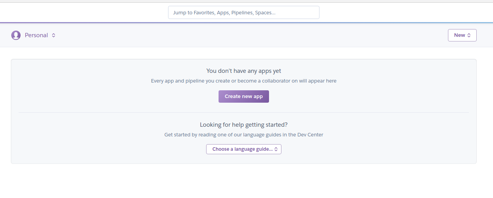
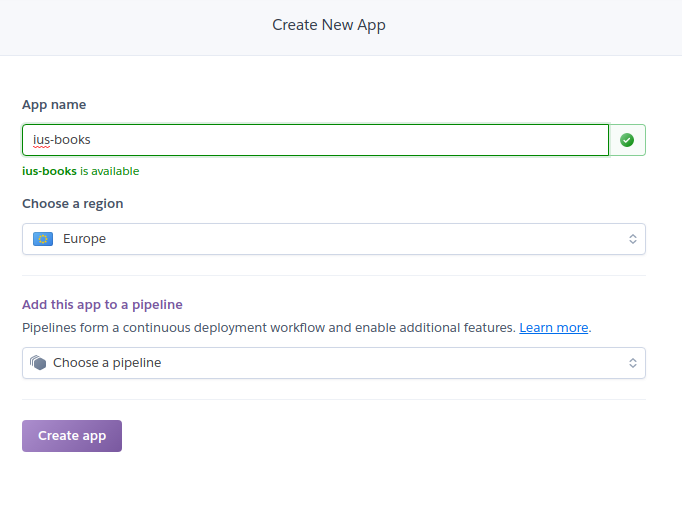
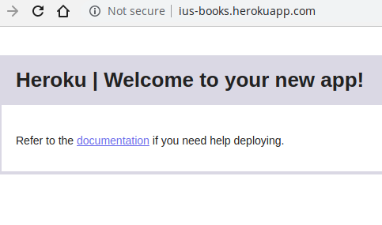
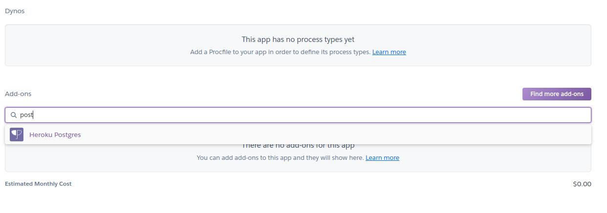
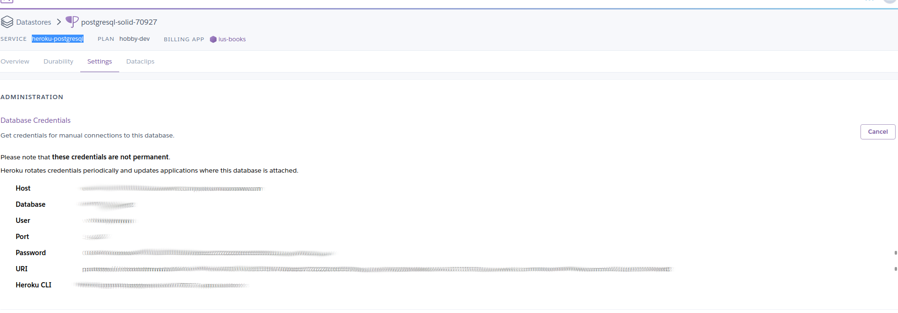

# Зміст

${toc}

# Testing

**Функціональне тестування** - це тестування ПО з метою перевірки можливості бути реалізованим функціональних вимог, тобто здатності ПО в певних умовах вирішувати завдання, потрібні користувачам. Функціональні вимоги визначають, що саме робить ПЗ, які завдання воно вирішує.

**Функціональні тести** дозволяють перевірити, що контролер правильно обробляє запити. Оскільки контролер також викликає код уявлення для запитаних дій, то в функціональний тест можна включати твердження про вміст відповіді.

Переваги функціонального тестування:

- Імітація реального користувача, погляд очима цього користувача.

Недоліки функціонального тестування:

- велика ймовірність при перевірці функціональності упустити різні логічні помилки в ПЗ;
- ймовірність надмірного тестування;
- швидкість виконання функціональних тестів повільніша ніж модульних.

## Mocha, Chai

**Mocha** - це багатофункціональний фреймворк тестування JavaScript, що працює на Node.js та в браузері, що робить асинхронне тестування простим та цікавим. **Chai** - assert - бібліотека.

Щоб встановити потрібні залежності:

```bash
npm i -D mocha chai chai-http sqlite3
```

- sqlite3 знадобиться для бази даних. Ми будемо застосовувати для тестів легковісну реляційну базу даних.

Структура тестів mocha:

```js
describe('test suite title', function() {

    before(function(done) {
        // runs before all tests in this file regardless where this line is defined.
        done();//end of execution
    });

    after(function(done) {
        // runs after all tests in this file
        done();//end of execution
    });

    beforeEach(function(done) {
        // runs before each test in this block
        done();//end of execution
    });

    afterEach(function(done) {
        // runs after each test in this block
        done();//end of execution
    });

    // test case
    it('test 1', done => {
        //test body
        done();//end of execution
    });

    // test case
    it('test 2', done => {
        //test body
        done();//end of execution
    });
});
```

## Тестування додатку "books"

В якості проекту для тестування візьмемо:

- [node-js-examples](https://github.com/endlesskwazar/node-js-examples)
- branch books

Змінемо кофігурацію бази даних:

config.json:
```json
...
"test": {
    "storage": "db_test.sqlite3",
    "dialect": "sqlite",
    "operatorsAliases": false,
    "logging": false
  },
...
```

Додамо скрипт тестування в package.json:

```json
...
"test": "NODE_ENV=test && npx sequelize-cli --env test db:migrate && mocha --timeout 10000"
...
```

Експортуємо головний додаток для можливості його тестування:

index.js:

```js
...
exports.app = app;
...
```

Для зручності вимкнемо csrf:

```js
const csrf = require('csurf');

const csrfProtection =  () => {
    if (process.env.NODE_ENV === 'test') {
        return csrf({ ignoreMethods: ['GET', 'HEAD', 'OPTIONS', 'POST', 'PUT'] });
    }
    return csrf({ cookie: true });
}

exports.csrfProtection = csrfProtection;
```

1. Почнимо із простого тесту, який перевіряє, що неавторизований користувач не може отримати доступ до головної сторінки:

test/home.js:

```js
process.env.NODE_ENV = 'test';

let chai = require('chai');
let chaiHttp = require('chai-http');
let {app} = require('../');
let should = chai.should();

chai.use(chaiHttp);

describe('/GET / not logged in', () => {
    it('it should be redirected to login page', done => {
        chai.request(app)
        .get('/')
        .end((err, res) => {
            chai.expect(res).to.have.status(200);
            chai.expect(res.text).contain('Login');
            chai.expect(res.text).contain('Password');
            done();
        });
    });
});
```

2. Далі створимо тести, які перевірять систему безпеки:

test/auth.js:

```js
process.env.NODE_ENV = 'test';

let chai = require('chai');
let chaiHttp = require('chai-http');
let {app} = require('../');
let {User} = require('../models');

chai.use(chaiHttp);

describe('/GET register', () => {
    it('it should displays register form', done => {
        chai.request(app)
        .get('/register')
        .end((err, res) => {
            chai.expect(res).to.have.status(200);
            chai.expect(res.text).contain('Login');
            chai.expect(res.text).contain('Password');
            done();
        });
    });
});

describe('/POST register', () => {
    it('it should display validation errors', done => {
        chai.request(app)
        .post('/register')
        .type('form')
        .send({'email': '', 'password': ''})
        .end((err, res) => {
            chai.expect(res.text).contain('Validation notEmpty on email failed');
            chai.expect(res.text).contain('Validation isEmail on email failed');
            chai.expect(res.text).contain('Validation notEmpty on password failed');
            done();
        });
    });

    it('it should create user in database', done => {
        chai.request(app)
        .post('/register')
        .type('form')
        .send({'email': 'test@test.com', 'password': 'test'})
        .end(async (err, res) => {
            chai.expect(res).to.have.status(200);
            const user = await User.findOne({where: {email: 'test@test.com'}});
            chai.expect(user).to.not.be.null;
            done();
        });
    });
});

describe('/GET login', () => {

    before(done => {
        chai.request(app)
        .post('/register')
        .type('form')
        .send({'email': 'test@test.com', 'password': 'test'})
        .end((err, res) => {
            done();
        })
    });

    it('it should display login form', done => {
        chai.request(app)
        .get('/login')
        .end((err, res) => {
            chai.expect(res).to.have.status(200);
            chai.expect(res.text).contain('Login');
            chai.expect(res.text).contain('Password');
            chai.expect(res.text).contain('Submit');
            done();
        });
    });

    it('it should logged user', done => {
        chai.request(app)
        .post('/login')
        .type('form')
        .send({'email': 'test@test.com', 'password': 'test'})
        .end((err, res) => {
            chai.expect(res).to.redirect;
            done();
        });
    });

    after(done => {
        User.destroy({
                where: {},
                truncate: true
        })
        .then(() => {
            done();
        });
    });

    
});
```

3. Тести для перевірки роботи із колекціями

test/collection.js:

```js
process.env.NODE_ENV = 'test';

let chai = require('chai');
let { app } = require('../');
let { User } = require('../models');
let { Collection } = require('../models');

describe('/GET collections', () => {

    before(done => {
        chai.request(app)
            .post('/register')
            .type('form')
            .send({ 'email': 'test@test.com', 'password': 'test' })
            .end(async (err, res) => {
                const user = await User.findOne({ where: { email: 'test@test.com' } });
                await Collection.create({ title: 'testCollection', userId: user.id });
                done();
            });
    });

    it('should redirect if user not logged in', done => {
        chai.request(app)
            .get('/collections')
            .end(async (err, res) => {
                chai.expect(res.text).contain("Login");
                chai.expect(res.text).contain("Password");
                chai.expect(res.text).contain("Submit");
                done();
            });
    });


    it('should display collections page if user logged', done => {
        let agent = chai.request.agent(app);
        agent.post('/login')
            .type('form')
            .send({ 'email': 'test@test.com', 'password': 'test' })
            .then(res => {
                agent.get('/collections')
                    .then(res2 => {
                        chai.expect(res2.text).contain('<h1>Books Collections</h1>');
                        chai.expect(res2.text).contain('testCollection');
                        done();
                    })
            })
    });

    after(done => {
        Collection.destroy({
            where: {},
            truncate: true
        })
        .then(() => {
            return User.destroy({
                where: {},
                truncate: true
            });
        })
        .then(() => {
            done();
        });
    });

});

describe('/POST /collections/create', () => {

    before(done => {
        chai.request(app)
            .post('/register')
            .type('form')
            .send({ 'email': 'test@test.com', 'password': 'test' })
            .end(async (err, res) => {
                const user = await User.findOne({ where: { email: 'test@test.com' } });
                await Collection.create({ title: 'testCollection', userId: user.id });
                done();
            });
    });

    it('it should create collection', done => {
        var agent = chai.request.agent(app)
        agent
            .post('/login')
            .type('form')
            .send({ 'email': 'test@test.com', 'password': 'test' })
            .then(function (res) {
                agent.post('/collections/create')
                  .type('form')
                  .send({ title: 'newCollection' })
                  .then(res2 => {
                    chai.expect(res2.text).contain('<h1>Books Collections</h1>');
                    chai.expect(res2.text).contain('newCollection');
                      done();
                  })
            });
    });


    after(done => {
        
        Collection.destroy({
            where: {},
            truncate: true
        })
        .then(() => {
            return User.destroy({
                where: {},
                truncate: true
            });
        })
        .then(() => {
            done();
        });

    });
});
```

Для запуску тестів достатньо потрібно виконати команду:

```bash
npm test
```

Код повністю можна знайти на:

- [node-js-examples](https://github.com/endlesskwazar/node-js-examples)
- branch: books-test

# Heroku

**Heroku** - хмарна PaaS-платформа, що підтримує ряд мов програмування. Heroku, одна з перших хмарних платформ, з'явилася в червні 2007 року і спочатку підтримувала тільки мову програмування Ruby, але на даний момент список підтримуваних мов також включає в себе Java, Node.js, Scala, Clojure, Python, Go і PHP. На серверах Heroku використовуються операційні системи Debian або Ubuntu.

Для ознайомлення із Heroku почати варто з поняття **dyno hours**. Згідно з документацією, Dyno hours - це, по суті, час роботи вашого додатка / додатків, виражене в годинах / місяць. Відразу після реєстрації безкоштовного аккаунта вам дається 550 годин на місяць. Провівши нескладні калькуляції, отримуємо близько 17 годин в день для однієї програми. Малувато буде. Тому прив'язуємо кредитну карту в Account settings - Billing і отримуємо ще 450 безкоштовних годин (32 години на добу вже з головою). Цю проблему вирішили. Є ще одна.


У вищезгаданому документі зазначено також про "сон" (dyno sleeping) додатки при відсутності активності протягом 30 хвилин. На просторах інтернету зустрічається три основні підходи:

1. Регулярно (наприклад, раз в 5 хвилин) відсилати запити зсередини самого додатка.

За допомогою JavaScript це буде виглядати так:

```js
var http = require("http");
setInterval(function() {
    http.get("http://<your app name>.herokuapp.com");
}, 300000);
```

2. Використовувати зовнішні сайти "пінгалки", які будуть із заданою періодичністю перевіряти ваш сайт.

Прикладом таких сайтів є [Pingdom](https://www.pingdom.com), [Uptime Robot](https://uptimerobot.com), [Kaffeine](http://kaffeine.herokuapp.com/) і інші.

3. Використовувати Heroku Newrelic addon. Даний плагін призначений для моніторингу та повідомлення про падіння сайту, але як корисний "побічний ефект" він не дасть заснути додатку.

# Розгортання Node.js - проекту на Heroku

Для початку зайдемо на [Heroku](https://www.heroku.com) і зареєструємося. Після успішної реєстрації і авторизації нам буде доступний dashboard:



Створимо новий застосунок:



Перевірити роботоспособність створеного додатку можна перейшовши на [your-app-name].herokuapp.com



Повернімося в dashboard і на вкладці addons додаймо postgresql:



Для того, щоб дізнатися строку підключення до БД, потрібно клікнути в деталях heroku-postgresql вибрати settings/view credentioals:



**Запом'ятаймо, де цю інформацію можна знайти вона нам знадобиться.**

# Домашнє завдання

1. Протестуйте розроблений проект на лабораторній роботі №7.
2. Задеплойте проект на heroku.

> При заливанні проекту з тестами в RADME.md потрібно вказати посилання на heroku разом із ім'ям користувача і його паролем(від розробленого додатку, в не від heroku).

# Контрольні запитання

1. Що таке функцыональны тести? Які їхні переваги і недоліки?
2. Для чого використовуються mocha і chai?
3. Поясніть структуру тестів mocha.
4. Поясніть процес розгортання node.js - проекту на Heroku.