# Зміст

$ {toc}

# Веб - сайт vs Веб - сервіс

Коли ви вводите URL в браузер і отримуєте у відповідь HTML - сторінку, яку відображає браузер, ви скористалися **веб - сайтом**.

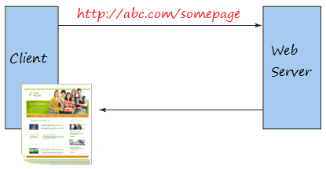

При цьому, **веб-сервіс** є поняттям більш розширеним у порівнянні з поняттям звичайного веб - сайта, він надає необроблену інформацію, і складний для більшості користувачів. Тому він використовується додатками. Ці додатки аналізують дані перед тим як повернути їх кінцевому користувачу.

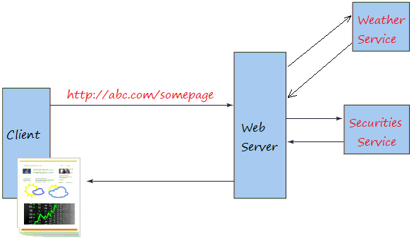

**Веб - сервіси** часто надають необроблені дані, які складно зрозуміти більшості звичайних користувачів, вони зазвичай повертаються в форматі XML або JSON.

# SOAP

**SOAP** (від англ. Simple Object Access Protocol - простий протокол доступу до об'єктів) - протокол обміну структурованими повідомленнями в розподіленої обчислювальної середовищі. Спочатку SOAP призначався в основному для реалізації віддаленого виклику процедур (RPC). Зараз протокол використовується для обміну довільними повідомленнями в форматі XML, а не тільки для виклику процедур.

SOAP є одним зі стандартів, на яких базуються технології веб-служб.

В SOAP сторони обмінюються SOAP - конвертами:


Приклад SOAP-запиту на сервер інтернет-магазину:

```xml
<?xml version="1.0" encoding="utf-8"?>
<soap:Envelope xmlns:xsi="http://www.w3.org/2001/XMLSchema-instance" xmlns:xsd="http://www.w3.org/2001/XMLSchema" xmlns:soap="http://schemas.xmlsoap.org/soap/envelope/">
   <soap:Body>
     <getProductDetails xmlns="http://warehouse.example.com/ws">
       <productID>12345</productID>
     </getProductDetails>
   </soap:Body>
</soap:Envelope>
```

Приклад відповіді:

```xml
<?xml version="1.0" encoding="utf-8"?>
<soap:Envelope xmlns:xsi="http://www.w3.org/2001/XMLSchema-instance" xmlns:xsd="http://www.w3.org/2001/XMLSchema" xmlns:soap="http://schemas.xmlsoap.org/soap/envelope/">
   <soap:Body>
     <getProductDetailsResponse xmlns="http://warehouse.example.com/ws">
       <getProductDetailsResult>
         <productID>12345</productID>
         <productName>Стакан граненый</productName>
         <description>Стакан граненый. 250 мл.</description>
         <price>9.95</price>
         <currency>
             <code>840</code>
             <alpha3>USD</alpha3>
             <sign>$</sign>
             <name>US dollar</name>
             <accuracy>2</accuracy>
         </currency>
         <inStock>true</inStock>
       </getProductDetailsResult>
     </getProductDetailsResponse>
   </soap:Body>
</soap:Envelope>
```

**WSDL** (англ. Web Services Description Language) - мова опису веб-сервісів і доступу до них, заснований на мові XML.

Кожен документ WSDL можна розбити на наступні логічні частини:

- визначення типів даних (types) - визначення виду відправлених і отриманих сервісом XML-повідомлень
- елементи даних (message) - повідомлення, що використовуються web-сервісом
- абстрактні операції (portType) - список операцій, які можуть бути виконані з повідомленнями
- зв'язування сервісів (binding) - спосіб, яким повідомлення буде доставлено

Приклад WSDL:

```xml
<message name="getTermRequest">
   <part name="term" type="xs:string"/>
</message>

<message name="getTermResponse">
   <part name="value" type="xs:string"/>
</message>

<portType name="glossaryTerms">
  <operation name="getTerm">
      <input message="getTermRequest"/>
      <output message="getTermResponse"/>
  </operation>
</portType>
```

[Реальний приклад WSDL](http://cs.au.dk/~amoeller/WWW/webservices/wsdlexample.html)

# REST

Перші поняття про REST (REpresentational State Transfer) були введені в 2000 році в докторської дисертації Roy Thomas Fielding (співзасновник HTTP). У дисертації він детально знайомить з обмеженнями, правилами, як і зі способами виконання в системі для отримання системи REST.

REST визначає правила архітектури для дизайну ваших Web services, фокусується на систематичних ресурсах, включаючи якого формату стан ресурсів і передається по HTTP, і написаний різними мовами. Якщо порахувати за кількістю використовують веб сервісів, REST став популярним за минулі роки як сервіс моделі дизайну з перевагою. Насправді, REST має великий вплив і майже замінив SOAP і WSDL так як його набагато простіше і легше використовувати.

REST це набір правил для створення додатка Web Service, який слід 4 основним правилам дизайну:

- Використовувати явні методи HTTP
- Не має стану
- Відображає структуру папок як URls

## Використовувати явні методи HTTP

REST ставить правило, яке потребує проммістов визначити їх мета через метод HTTP. Зазвичай ці цілі включають отримання даних, вставити дані, оновлення даних або видалення даних. Тому коли ви хочете виконати одне із завдань вище, зауважте наступні правила:

Щоб створити ресурс на сервері, вам потрібно використовувати метод POST. Для отримання ресурсу, використовуйте GET. Щоб поміняти стан ресурсу або оновити його, використовуйте PUT. Щоб скасувати або видалити ресурс, використовуйте DELETE.

Зауважте, що правила вище необов'язкові, насправді ви можете метод GET щоб отримати дані, вставляти, змінювати або видаляти дані на Сервері. Але REST дає правила вище які націлені всі прояснити і пояснити.


## Не має стану

Одне з властивостей REST це бути без стану (stateless), тобто він не зберігає інформацію клієнта. Наприклад ви відправляєте запит, щоб подивитися 2 сторінку документа, і Терера ви хочете подивитися наступну сторінку (сторінки 3). REST не зберігає інформацію про те, що він давав вам сторінку 2. Це означає REST не керує сесією (Session).

## Відображає структуру папок як URls

REST дає структуру щоб користувач міг мати доступ в власні ресурси через URL. Ресурси тут є всім, що ви можете назвати (Відео, фото, звіт погоди, ...)

Вам потрібно створити REST serivce щоб він повернув користувачеві відповідні ресурси. Посилання REST service повинні бути інтуїтивними, щоб користувачі могли легко вгадати. Подумайте про посилання (URI) як про ясну підказку, яку легко можна вгадати, куди вона веде і які ресурси надає. Якщо коротко, структурі URI слід бути простий, легко вгадати і зрозуміти.

**Best practices for urls**:

1. **Використовувати множину**

Використовуйте множину для назви своїх REST сервісів. Це ще одна гаряча тема для обговорень серед REST дизайнерів - вибір між єдиними або множинними формами іменників для позначення сервісів.

Best Practice:

/farmers
/farmers/{farmer_id}
/crops
/crops/{crop_id}
Не рекомендуется:

/farmer
/farmer/{farmer_id}

2. **Версія вашого додатка**

Будь-яке програмне забезпечення розвивається з плином часу. Це може зажадати різних версій для всіх істотних змін в додатку. Коли справа доходить до версії REST додатки, то воно стає однією з найбільш обговорюваних тем серед спільноти розробників REST.

Приклад версіонування API:

host/v2/farmers
host/v1/farmers

3. **Моделювання зв'язків**

- users/{:id}/posts/{:id}/comments

4. **Ефективне використання HTTP Status Code**

HTTP визначає різні коди відповідей для вказівки клієнту різної інформації про операції. Ваше REST додаток могло б ефективно використовувати всі доступні HTTP-коди, щоб допомогти клієнту правильно налаштувати відповідь. Далі представлений список кодів відповідей HTTP:

- 200 OK - це відповідь на успішні GET, PUT, PATCH або DELETE. Цей код також використовується для POST, який не приводить до створення.
- 201 Created - цей код стану є відповіддю на POST, який призводить до створення.
- 204 Немає вмісту. Це відповідь на успішний запит, який не повертатиме тіло (наприклад, запит DELETE)
- 304 Not Modified - використовуйте цей код стану, коли заголовки HTTP-кешування знаходяться в роботі
- 400 Bad Request - цей код стану вказує, що запит спотворений, наприклад, якщо тіло не може бути проаналізовано
- 401 Unauthorized - Якщо не вказані або недійсні дані аутентифікації. Також корисно активувати спливаюче вікно auth, якщо програма використовується з браузера
- 403 Forbidden - коли аутентифікація пройшла успішно, але аутентіфіцированний користувач не має доступу до ресурсу
- 404 Not found - якщо запитується неіснуючий ресурс
- 405 Method Not Allowed - коли запитується HTTP-метод, який не вирішено для аутентифицированного користувача
- 410 Gone - цей код стану вказує, що ресурс в цій кінцевій точці більше не доступний. Корисно в якості захисного відповіді для старих версій API
- 415 Unsupported Media Type. Якщо в якості частини запиту було вказано неправильний тип вмісту
- 422 Unprocessable Entity - використовується для перевірки помилок
- 429 Too Many Requests - коли запит відхиляється через обмеження швидкості

Приклад хороших RESTfull - api [GitHub Developer](https://developer.github.com/v3/)

# Простий приклад RESTfull на express

- Репозиторій - [node-js-examples](https://github.com/endlesskwazar/node-js-examples)
- Гілка - simple-message-api

## Ручне тестування додатку

Оскільки, ми не використовуємо handlebars або інший renderer подивитися результат роботи застосунку в браузері неможна. Для цього нам знадобляться один із інструментів: 
[Postman](https://www.getpostman.com/) або [Insomnia](https://insomnia.rest/).

**Додавання повідомлення**

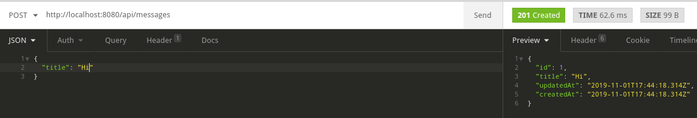

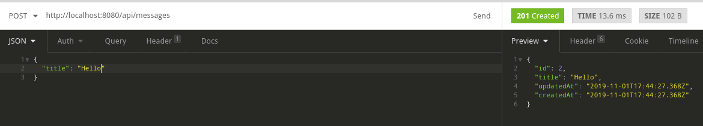

**Отримання списку всіх повідомлень**

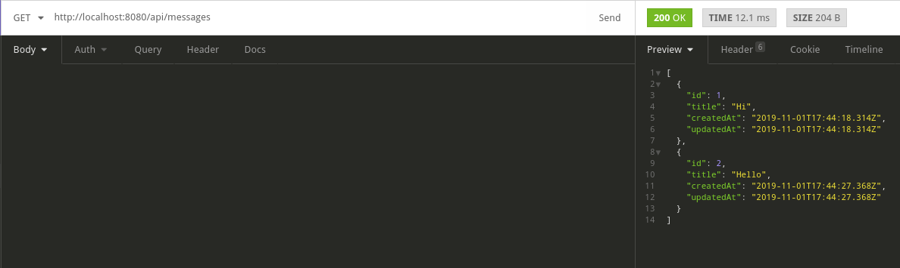

**Отримання одного повідомлення**

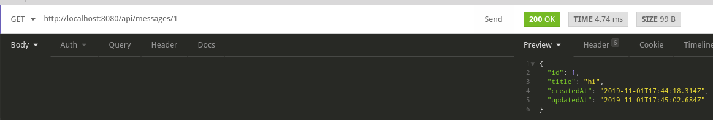

**Модифікація повідомлення**

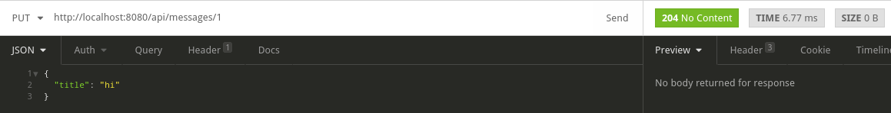

# JWT

**JSON Web Token (JWT)** - це відкритий стандарт (RFC 7519) для створення токенів доступу, заснований на форматі JSON. Як правило, використовується для передачі даних аутентифікації в клієнт-серверних додатках. Токени створюються сервером, підписуються секретним ключем і передаються клієнту, який в подальшому використовує даний токен для підтвердження своєї особи.

**Токен JWT** складається з трьох частин: заголовок (header), корисне навантаження (payload) і підпис або дані шифрування. Перші два елементи - це JSON об'єкти певної структури. Третій елемент обчислюється на підставі перших і залежить від обраного алгоритму (у випадку використання не підписаного JWT може бути опущений).

- Заголовок(header) - У заголовку вказується необхідна інформація для опису самого токена.
- Корисне навантаження(payload) - У даній секції вказується інформація користувача (наприклад, ім'я користувача і рівень його доступу)

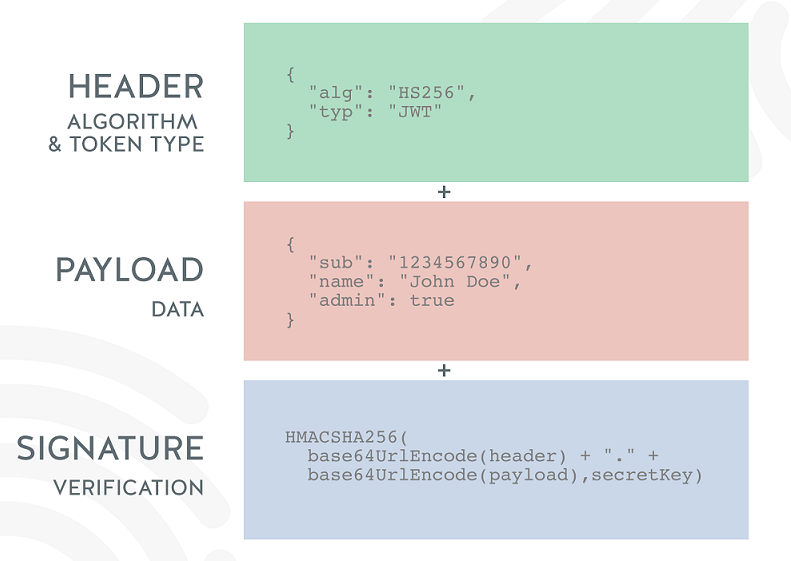

Алгоритм роботи:

1. Клієнт проходить аутентифікацію в додатку (наприклад, з використанням логіна і пароля)
2. У разі успішної аутентифікації, сервер відправляє клієнту access- і refresh-токени.
3. При подальшому зверненні до сервера, клієнт використовує access-токен.
4. Сервер перевіряє токен на валідність і надає клієнту доступ до ресурсів


Весь код додатку можна подивитися на:

- Репозиторій - [node-js-examples](https://github.com/endlesskwazar/node-js-examples)
- Гілка - jwt-example

## Приклад роботи із додатком

1. Для початку нам потрібно зареєструвати користувача

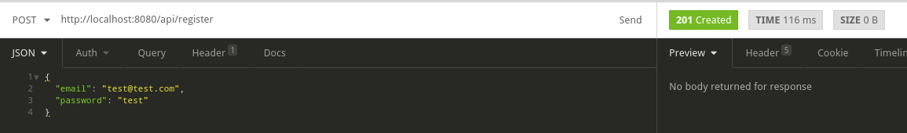

2. Потім потрібно отримати токен

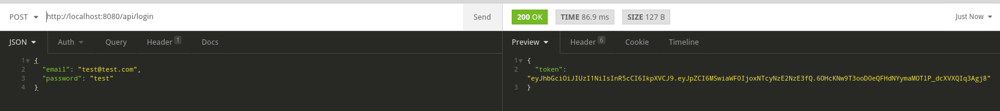

3. Далі отриманий токен потрібно додати в заголовок і виконати запит на захищену адресу

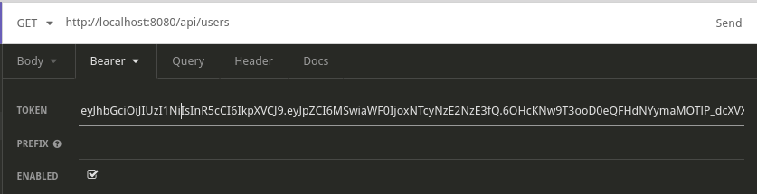

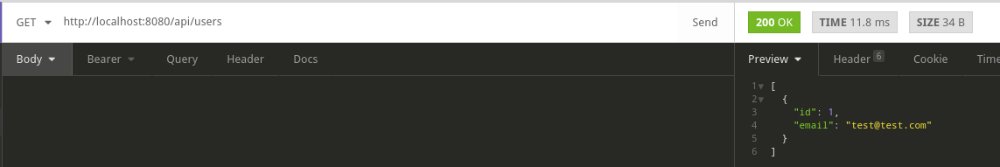

# Приклад RESTfull

Поєднаємо два вище наведені додатки:

- Репозиторій - [node-js-examples](https://github.com/endlesskwazar/node-js-examples)
- Гілка - message-api

**Зареєструємо користувача**

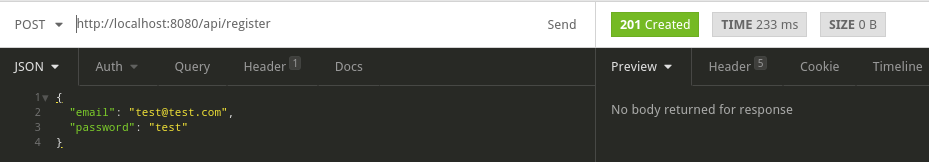

**Отримаємо токен**

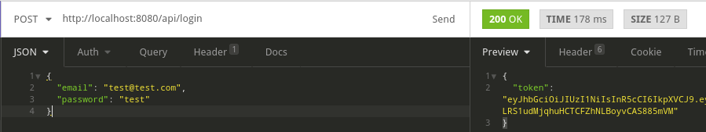

**Створимо декілька повідомлень**

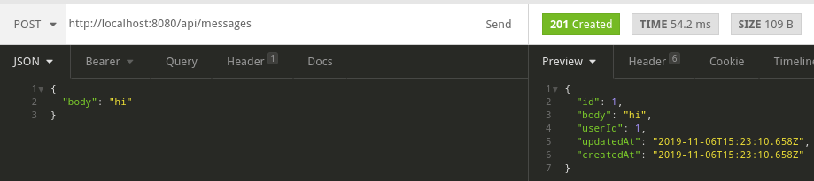

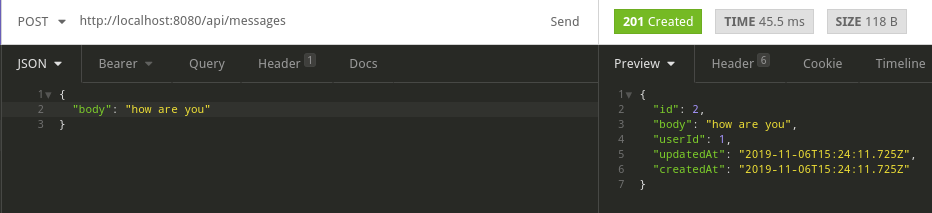

**Отримаємо список всіх повідомлень**

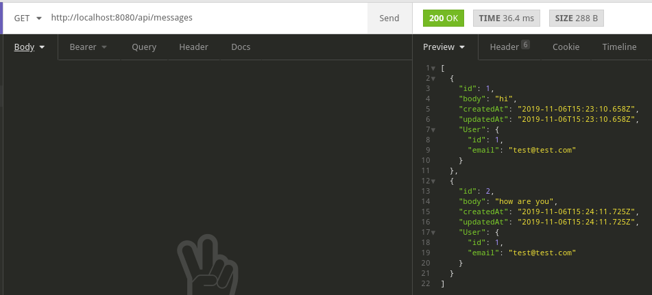

**Видалимо повідомлення**

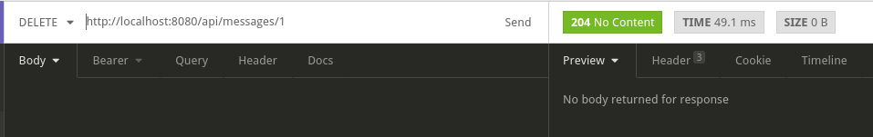

**Отримаємо список користувачів**

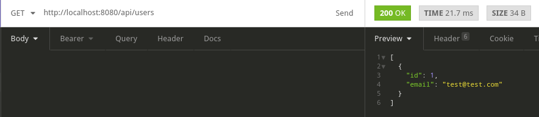


# Документація endpoints(swagger)


**Swagger** - це програмне забезпечення з відкритим кодом, що підтримується великою екосистемою інструментів, яка допомагає розробникам розробляти, створювати, документувати та споживати RESTful веб-сервіси.

Для express існує пакет **swagger-ui-express**:

```bash
npm install swagger-ui-express
```

```js
const express = require('express');
const app = express();
const swaggerUi = require('swagger-ui-express');
const swaggerDocument = require('./swagger.json');
 
var options = {
  swaggerOptions: {
    validatorUrl: null
  }
};
 
app.use('/api-docs', swaggerUi.serve, swaggerUi.setup(swaggerDocument, options));
```

Сама документація описується по специфікації OpenApi у форматах json або yaml.

OpenApi складається із:

|Поле|Тип|Пояснення|
|-|-|-|
|openapi|string|**REQUIRED** Семантична версія OpenApi, яка використовується.|
|info|Info Object|**REQUIRED**  Метадата. Заголовок додатка, опис, контакти, ліцензія, версія.|
|servers|Server Object|Масив об’єктів сервера, які надають інформацію про підключення до цільового сервера.|
|paths|Paths Object|**REQUIRED** Доступні шляхи та операції для API.|
|security|Security Requirement Object]|Декларація, які механізми захисту можна використовувати в API.|
|externalDocs|External Documentation Object|Додаткова зовнішня документація.|

Подивитися специфікацію можна на [swagger.io](https://swagger.io/specification/)

- Репозиторій - [node-js-examples](https://github.com/endlesskwazar/node-js-examples)
- Гілка - message-api-doc

# Домашнє завдання

Переробіть проект, який був розроблений на лабораторній роботі №8 на RESTfull веб - сервіс. Використовуючи swagger, напишіть просту документацію.

# Контрольні запитання

1. Чим веб - сайт відрізняється від веб -сервісу?
2. Що таке SOAP? Назвіть недоліки SOAP.
3. Що таке REST? Поясніть принципи REST.
4. Що таке JWT?
5. Що таке swagger. Поясніть Open Api Specification.