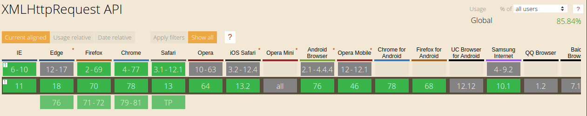
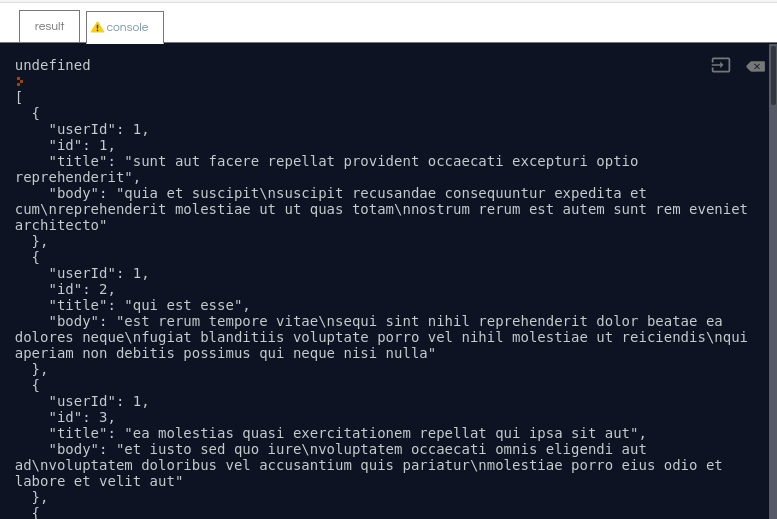
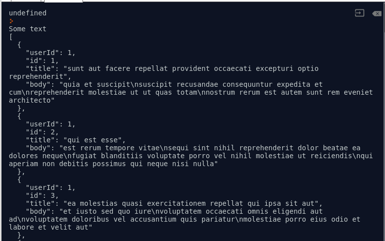
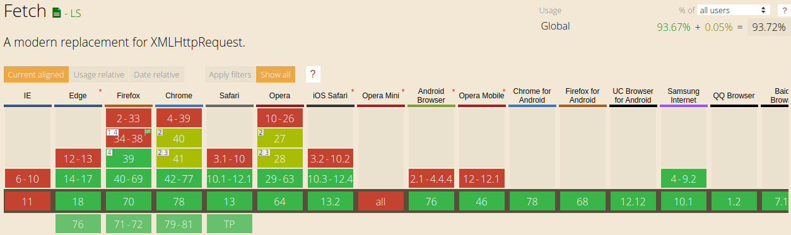
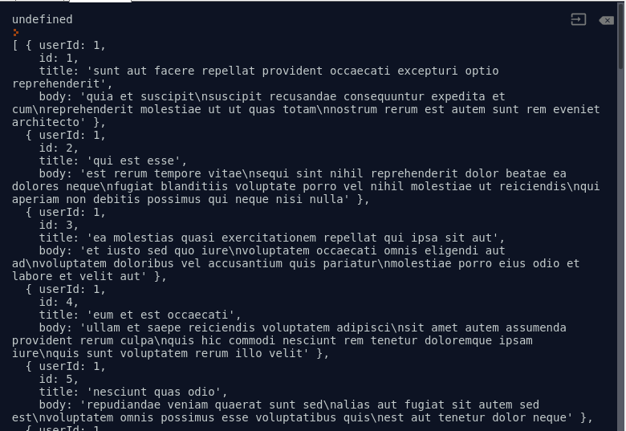
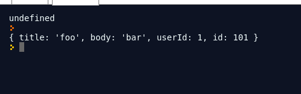
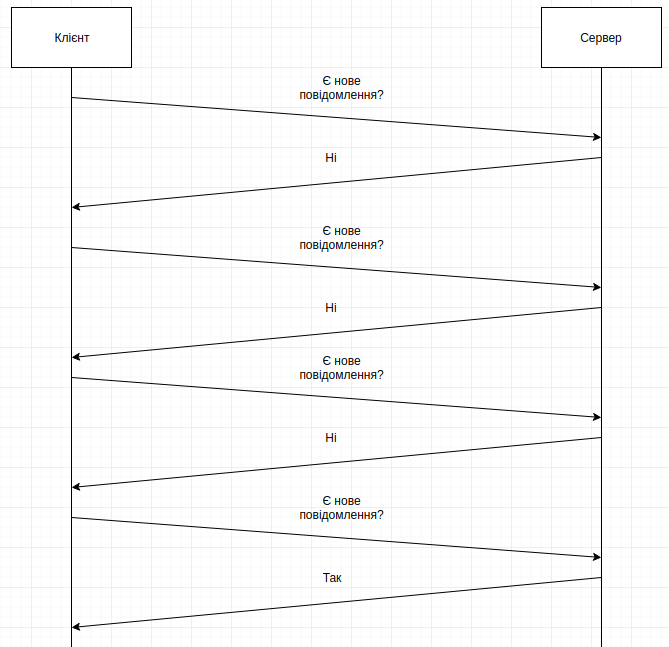
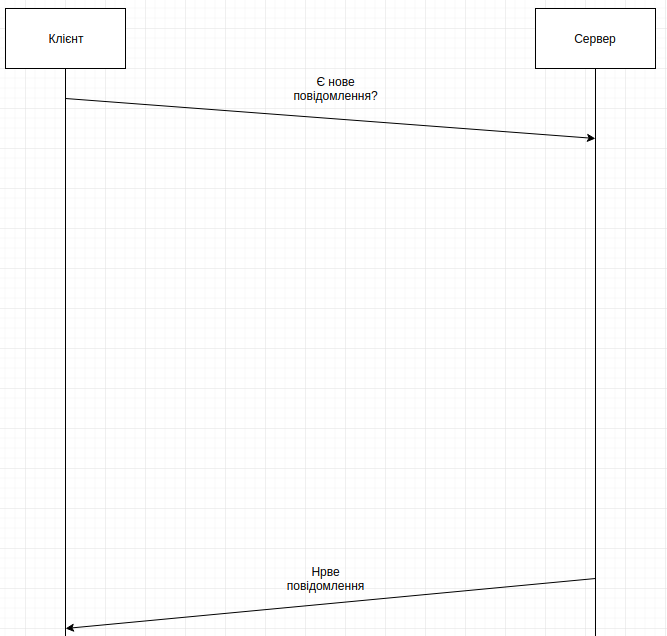

# Ajax

**AJAX** (Asynchronous JavaScript And XML) — підхід до побудови користувацьких інтерфейсів веб-застосунків, за яких веб-сторінка, не перезавантажуючись, у фоновому режимі надсилає запити на сервер і сама звідти довантажує потрібні користувачу дані. AJAX — один з компонентів концепції DHTML.

**Класична модель:**

1. Користувач заходить на веб-сторінку і натискає на який-небудь її елемент
2. Браузер надсилає запит серверу
3. У відповідь сервер генерує повністю нову веб-сторінку і відправляє її браузеру і т. д.
   1. З боку сервера можлива генерація не всієї сторінки наново, а тільки деяких її частин, з подальшою передачею користувачу.

**Модель AJAX:**

1. Користувач заходить на веб-сторінку і натискає на який-небудь її елемент.
2. Браузер відправляє відповідний запит на сервер.
3. Сервер віддає тільки ту частину документа, яка змінилася.

# XMLHttpRequest vs vs Fetch

**XMLHttpRequest** - це об'єкт JavaScript, створений Microsoft і адаптований Mozilla. Ви можете використовувати його для простої передачі даних через HTTP. Незважаючи на свою назву, він може бути використаний не тільки для XML документів, а й, наприклад, для JSON.

XHR з'явився в 2005 році і підтримується всіма сучасними браузерами.



**Приклад:**

```js
const xhr = new XMLHttpRequest();
xhr.open('GET', 'https://jsonplaceholder.typicode.com/posts', false); 
xhr.send(null);
if(xhr.status == 200) {
  console.log(xhr.responseText);
}
else {
  console.log('There is an error!');
}
```



Цей код показує синхронний запит. Приклад асинхронного запиту:

```js
const xhr = new XMLHttpRequest();
xhr.open('GET', 'https://jsonplaceholder.typicode.com/posts', true); // true - async
xhr.onreadystatechange = function (aEvt) {
  if (xhr.readyState == 4) {
     if(xhr.status == 200)
      console.log(xhr.responseText);
     else
      console.log("Error loading page\n");
  }
};
xhr.send(null);
console.log('Some text');
```



**Fetch API** надає інтерфейс JavaScript для роботи із запитами та відповідями HTTP. Він також надає глобальний метод fetch (), який дозволяє легко і логічно отримувати ресурси по мережі асинхронно.



Приклад:

```js
fetch('https://jsonplaceholder.typicode.com/posts')
.then(response => {
  return response.json();
})
.then(data => {
  console.log(data);
})
.catch(err => {
  console.log(err);
});
```



Синхронний приклад:

```js
(async function getData() {
  try {
    const response = await fetch('https://jsonplaceholder.typicode.com/posts');
    const data = await response.json();
    console.log(data);
  }
  catch (err) {
    console.log(err);
  }

})();
```

fetch крім параметра url, ще може приймати другим параметрлом об'єкт конфігурації, який вказує деталі запиту:

```js
fetch(url, {
    method: 'POST', // *GET, POST, PUT, DELETE, etc.
    mode: 'cors', // no-cors, cors, *same-origin
    cache: 'no-cache', // *default, no-cache, reload, force-cache, only-if-cached
    credentials: 'same-origin', // include, *same-origin, omit
    headers: {
        'Content-Type': 'application/json',
        // 'Content-Type': 'application/x-www-form-urlencoded',
    },
    redirect: 'follow', // manual, *follow, error
    referrer: 'no-referrer', // no-referrer, *client
    body: JSON.stringify(data)
    })
```

Приклад:

```js
fetch('https://jsonplaceholder.typicode.com/posts', {
    method: 'POST',
    body: JSON.stringify({
      title: 'foo',
      body: 'bar',
      userId: 1
    }),
    headers: {
      "Content-type": "application/json; charset=UTF-8"
    }
  })
  .then(response => response.json())
  .then(json => console.log(json))
  .catch(err => {
    console.log(err);
  });
```




# Приклад клієнта

- Репозиторій - [node-js-examples](https://github.com/endlesskwazar/node-js-examples)
- Гілка - message-fetch

# Web Socket

**Веб-сокети (Web Sockets)** - це передова технологія, яка дозволяє створювати інтерактивне з'єднання між клієнтом (браузером) та сервером для обміну повідомленнями в режимі реального часу. Веб-сокети, на відміну від HTTP, дозволяють працювати з двонаправленим потоком даних, що робить цю технологію абсолютно унікальною. Давайте розберемося, як працює ця технологія і чим вона відрізняється від HTTP.

**HTTP**:



**WS**:

Веб-сокетам для відповіді не потрібні ваші повторювані запити. Досить виконати один запит і чекати відгуку. Ви можете просто слухати сервер, який буде відправляти вам повідомлення по мірі готовності.



## Приклад

- Репозиторій - [node-js-examples](https://github.com/endlesskwazar/node-js-examples)
- Гілка - message-ws

# Домашнє завдання

Доробіть до message-ws функціонал реєстрації і видалення повідомлення. Також доробіть перевірку правильності введення даних згідно із серверним додатком.

# Контрольні запитання

1. Що таке ajax?
2. Що таке XMLHTTPRequest API?
3. Що таке Fetch API?
4. Що таке і Веб -сокети?