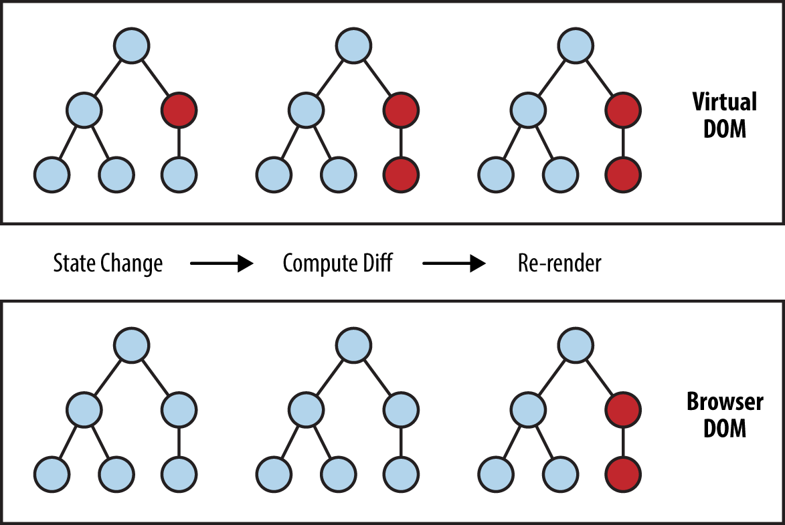
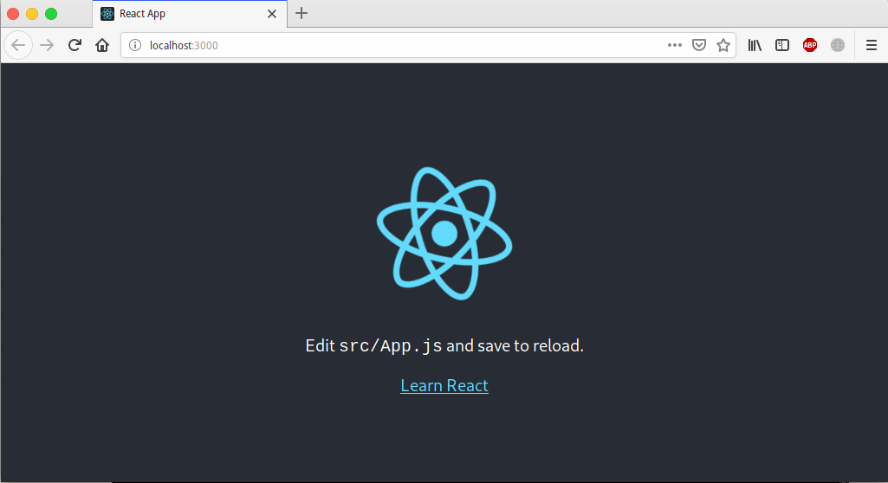
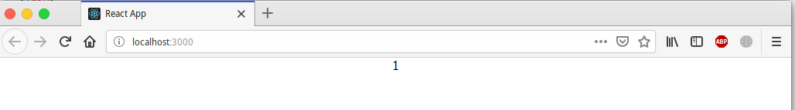
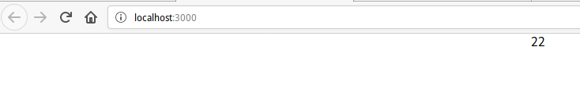

# React

${toc}

# Що таке react

**React (іноді React.js або ReactJS)** - JavaScript-бібліотека з відкритим вихідним кодом для розробки призначених для користувача інтерфейсів.

React розробляється і підтримується Facebook, Instagram і співтовариством окремих розробників і корпорацій.

React може використовуватися для розробки односторінкових і мобільних додатків. Його мета - надати високу швидкість, простоту і масштабованість. Як бібліотеки для розробки призначених для користувача інтерфейсів React часто використовується з іншими бібліотеками, такими як Redux.


## Компоненти

React має невеликий API, він простий у вивченні та використанні. Однак, спершу давайте поглянемо на кілька концепцій.

**Компоненти** - це елементи React, написані розробником. Зазвичай це частини призначеного для користувача інтерфейсу, які містять свою структуру і функціональність. Наприклад, такі як NavBar, LikeButton, або ImageUploader.

Компоненти дозволяють вам розділити UI на незалежні частини і працювати з кожною з них окремо.

Концептуально, компоненти подібні JavaScript-функціям. Вони приймають довільні дані (звані props) і повертають React-елементи, що описують що має з'явитися на екрані.


Приклад компонентів:

```js
const Greeting = () => <h1>Hello World today!</h1>;

function Greeting() {
    return <h1>Hello World today!</h1>
}
```

В прикладах вище компоненти повертають так-званий **JSX**. **JSX** - це препроцесор, який додає синтаксис XML до JavaScript. Ви можете використовувати React без JSX, але JSX робить React більш елегантним.

JSX - синтаксис, схожий на XML / HTML, який використовується в React, розширює ECMAScript, так що XML / HTML-подібний текст може співіснувати з кодом JavaScript / React. Синтаксис призначений для використання препроцесора (т. Е. Транспілерамі, такими як Babel), щоб перетворити HTML-подібний текст, знайдений в файлах JavaScript, в стандартні об'єкти JavaScript, які будуть аналізувати движок JavaScript.

В основному, використовуючи JSX, ви можете писати стислі структури HTML / XML (наприклад, DOM подібні деревовидні структури) в тому ж файлі, що і код JavaScript, а потім Babel перетворює ці вирази в код JavaScript. На відміну від минулого, замість того, щоб поміщати JavaScript в HTML, JSX дозволяє нам поміщати HTML в JavaScript.

## Virtual Dom

Головна проблема DOM - він ніколи не був розрахований для створення динамічного призначеного для користувача інтерфейсу (UI). Ми можемо працювати з ним, використовуючи JavaScript і бібліотеки на зразок jQuery, але їх використання не вирішує проблем з продуктивністю. Подивіться на сучасні соціальні мережі, такі як Twitter, Facebook або Pinterest. Після невеликого скролінгу, ми будемо мати десятки тисяч DOM-вузлів, ефективно взаємодіяти з якими - завдання не з легких.

Для прикладу, спробуйте перемістити 1000 div-блоків на 5 пікселів вліво. Це може зайняти більше секунди - це занадто багато для сучасного інтернету. Ви можете оптимізувати скрипт і використовувати деякі прийоми, але в підсумку це викличе лише головний біль при роботі з величезними сторінками і динамічним UI.

Virtual Dom Замість того, щоб взаємодіяти з DOM безпосередньо, ми працюємо з його легковагій копією. Ми можемо вносити зміни в копію, виходячи з наших потреб, а після цього застосовувати зміни до реального DOM. При цьому відбувається порівняння DOM-дерева з його віртуальної копією, визначається різниця і запускається перерисовка того, що було змінено.



## Create react app

Create React App - це офіційно підтримуваний спосіб створення односторінкових застосунків React. Він пропонує сучасні налаштування побудови без конфігурації.

```bash
npx create-react-app my-app
cd my-app
npm start
```



**Як працює створений проект:**

1. Завантажується index.html, який знаходиться в директорії public:

```html
...
 <body>
    <noscript>You need to enable JavaScript to run this app.</noscript>
    <div id="root"></div>
    <!--
      This HTML file is a template.
      If you open it directly in the browser, you will see an empty page.

      You can add webfonts, meta tags, or analytics to this file.
      The build step will place the bundled scripts into the <body> tag.

      To begin the development, run `npm start` or `yarn start`.
      To create a production bundle, use `npm run build` or `yarn build`.
    -->
  <script src="/static/js/bundle.js"></script><script src="/static/js/0.chunk.js"></script><script src="/static/js/main.chunk.js"></script></body>
  ...
```

2. Буде виконаний java-script bundle.js, який є конкатенаціює всіх скриптів проекту. Початкова точка index.js

3. За допомогою функції ReactDOM.render, ми знаходимо елемент з ідентифікатором root і відображаємо у ньому компонент, який описаний в App.js

```js
...
ReactDOM.render(<App />, document.getElementById('root'));
...
```

4. В компоненті App.js буде відображено, те що повиртає функція render

```js
class App extends Component {
  render() {
    return (
      <div className="App">
        <header className="App-header">
          
          <p>
            Edit <code>src/App.js</code> and save to reload.
          </p>
          <a
            className="App-link"
            href="https://reactjs.org"
            target="_blank"
            rel="noopener noreferrer"
          >
            Learn React
          </a>
        </header>
      </div>
    );
  }
}
```

# Smart vs dummy componensts. Class vs functional components

Найпростіший спосіб визначення компонента в React - це написання функції JavaScript:

```js
function Welcome(props) {
  return <h1>Hello, {props.name}</h1>;
}
```

Це просто функція, яка приймає props і повертає елемент React. Але ви також можете використовувати синтаксис класу ES6 для створення компонентів.

```js
class Welcome extends React.Component {
  render() {
    return <h1>Hello, {this.props.name}</h1>;
  }
}
```

Обидві версії еквівалентні і дадуть одинаковий результат. Тепер ви можете запитати себе: "Коли я повинен використовувати функцію а коли клас?"

**Різниця між функціональними і класс-компонентів:**

1. **Синтакс**

Найбільш очевидна одна відмінність - синтаксис. Функціональний компонент - це просто звичайна функція JavaScript, яка приймає props як аргумент і повертає елемент React.
Компонент класу вимагає, щоб ви наслідувалися від React.Component і створили функцію render, яка повертає елемент React. Для цього потрібно більше коду, але також ви отримаєте деякі переваги, які ви побачите далі.

2. **Стан**

Функціональні компоненти можуть мати(react hooks) або не мати стан. Pure function легка для тестування. Компоненти на основі класів завжди мають стан.

**Dumb components** також називаються «презентаційними» компонентами, оскільки їх єдиним обов'язком є щось представити DOM. Самі компоненти мають лише метод render () (вони не потребують інших) і часто є лише функціями Javascript. У них немає внутрішнього стану для управління. Вони б не знали, як змінити дані, які вони представляють.

```js
const Footer = (props) => {
  return(
  <div>
    <ul>
      <li>Footer Information</li>
    </ul>
  </div>
  )
}
```

**Smart components** (або компоненти контейнерів), з іншого боку, несуть різну відповідальність. Оскільки на них лежить тягар розумності, вони відстежують стан та дбають про те, як працює програма.

```js
class App extends Component {
  constructor(props){
    super(props);
    this.state = {pictures : []};
  }
}
```

## props

**props** - Це просто скорочення від властивостей. Props це механізм взаємодії між компонентами.

App.js:

```js
class App extends Component {
  render() {
    return (
      <div className="App">
        {this.props.counter}
      </div>
    );
  }
}
```

index.js:

```js
...
ReactDOM.render(<App counter="1"/>, document.getElementById('root'));
...
```



## State

На агглійській «state of a being» відноситься до фізичного стану людини, і це просто стан, який змінюється з часом. Ну, подібно до стану в React / React Native використовується компонент для відстеження інформації.

```js
class App extends React.Component {

  constructor() {
    super();
    this.state = {
      counter: 22
    }
  }

  render() {
    return (
      <div className="App">
        {this.state.counter}
      </div>
    );
  }
}
```



**Не змінюйте стан безпосередньо**

У наступному прикладі повторного рендеру не відбувається:

```js
this.state.comment = 'Hello';
```

Замість цього використовуйте setState ():

```js
this.setState({comment: 'Hello'});
```

Конструктор - це єдине місце, де ви можете присвоїти значення this.state безпосередньо.

## Components Lifecycle

Кожен компонент має кілька «методів життєвого циклу». Перевизначення такого методу дозволяє виконувати код на конкретному етапі цього процесу. Зрозуміти життєвий цикл можна подивившись на дану [діаграму](http://projects.wojtekmaj.pl/react-lifecycle-methods-diagram/).

|Функція|Пояснення|
|-|-|
|componentWillMount|виконується до рендеринга, як на сервері, так і на стороні клієнта.|
|componentDidMount|виконується після першої візуалізації тільки на стороні клієнта.|
|shouldComponentUpdate|має повернути значення true або false. Це визначить, чи буде компонент оновлюватися чи ні.|
|componentWillUpdate|визивається безпосередньо перед відтворенням|
|componentDidUpdate|викликається відразу після рендеринга|
|componentWillUnmount|викликається після того, як компонент відключено від дому.|

```js
class Content extends React.Component {
   componentWillMount() {
      console.log('Component WILL MOUNT!')
   }
   componentDidMount() {
      console.log('Component DID MOUNT!')
   }
   shouldComponentUpdate(newProps, newState) {
      return true;
   }
   componentWillUpdate(nextProps, nextState) {
      console.log('Component WILL UPDATE!');
   }
   componentDidUpdate(prevProps, prevState) {
      console.log('Component DID UPDATE!')
   }
   componentWillUnmount() {
      console.log('Component WILL UNMOUNT!')
   }
   render() {
      return (
         <div>
            <h3>{this.props.myNumber}</h3>
         </div>
      );
   }
}
```

# Стилі

1. **Інлайн - стилі**

```js
class App extends React.Component {

  constructor() {
    super();
    this.state = {
      counter: 22
    }
  }

  render() {
    return (
      <div className="App" style={{backgroundColor: "#44014C", color: "#ffffff"}}>
        {this.state.counter}
      </div>
    );
  }
}
```

2. **Об'єкт стилів**

```js
const TodoComponent = {
  width: "300px",
  margin: "30px auto",
  backgroundColor: "#44014C",
  minHeight: "200px",
  boxSizing: "border-box"
}

const Header = {
  padding: "10px 20px",
  textAlign: "center",
  color: "white",
  fontSize: "22px"
}

const ErrorMessage = {
  color: "white",
  fontSize: "13px"
}

class ToDoApp extends React.Component {
  // ...
  render() {
    return (
      <div style={TodoComponent}>
        <h2 style={Header}>ToDo</h2>
        <div>
          <Input onChange={this.handleChange} />
          <p style = {ErrorMessage}>{this.state.error}</p>
          <ToDoList value={this.state.display} />
        </div>
      </div>
    )
  }
}
```

3. **CSS - модулі**

CSS модуль це файл CSS, в якому всі імена класів і анімації мають локальну область видимості по-дефолту. Зверніть на це особливу увагу. Давайте розберемо.

Імена класів CSS і імена анімації мають глобальну область відімомості по-дефолту. Це може привести до конфліктів стилів, особливо в великих CSS. Попросту один стиль може бути перезаписан іншим стилем. Це саме та проблема, яку вирішують CSS модулі. CSS класи доступні тільки всередині компонента, в якому він використовується.

CSS модуль це насправді .css файл, який скомпільовано. Будучи скомпільований він видає дві видачі. Перша це CSS, який являє собою модифіковану версію написаного CSS з перейменованими класами. А інша, це JavaScript об'єкт, який формує вихідний CSS з уже перейменованими класами.

Давайте подивимося на приклад того, як це працює. Створюємо CSS клас в модулі для прикладу повідомлення помилки. Ім'я нашого модуля це styles.css:

```css
.error-message {
color: red;
font-size: 16px;
}
```

Будучи скомпільований, це видасть нам щось типу такого:

```css
.error-message_jhys {
color: red;
font-size: 16px;
}
```

jays це просто приставка, щоб надати унікальності ідентифікатора цього класу. Як говорилося раніше, створюється JS об'єкт, який може бути імпортований в React файл і далі вільно використовуватися:

```css
{
error-message: error-message_jhys
}
```

Давайте подивимося на те, як ми можемо це зараз використовувати:

```js
import styles from ‘./styles.css’;
class Message extends React.Component {
    // …
    render() {
        return (
        <p className = {styles.error-message}>I am an error message</p>
        )
    }
}
```

# Структура react - проекту

Єдиної думки не існує. Однак, є кілька популярних підходів, які ви можете розглянути.

1. **Груповання по функціональності або маршруту**

Один з популярних підходів - це розміщення файлів CSS, JS і тестів в папках, згрупованих за функціональністю або маршруту.

```
common/
  Avatar.js
  Avatar.css
  APIUtils.js
  APIUtils.test.js
feed/
  index.js
  Feed.js
  Feed.css
  FeedStory.js
  FeedStory.test.js
  FeedAPI.js
profile/
  index.js
  Profile.js
  ProfileHeader.js
  ProfileHeader.css
  ProfileAPI.js
```

2. Груповання по типу файлу

Іншим популярним способом структурування проектів є угруповання схожих файлів, наприклад:

```
api/
  APIUtils.js
  APIUtils.test.js
  ProfileAPI.js
  UserAPI.js
components/
  Avatar.js
  Avatar.css
  Feed.js
  Feed.css
  FeedStory.js
  FeedStory.test.js
  Profile.js
  ProfileHeader.js
  ProfileHeader.css
```

# Приклад клієнта

- repo - [node-js-examples](https://github.com/endlesskwazar/node-js-examples)
- branch - react-simple

# Домашнє завдання

Домашнє завдання відсутнє

# Контрольні запитання

1. Що таке React?
2. Поясніть концепцію компонентів.
3. Яка різниця між функціональними і компонентами, які базуються на класах?
4. Що таке props і state?
5. Перелічіть методи життєвого циклу react - компонента.